# 🛡️ Trust & Risk Intelligence System (TRIS)

**Enterprise Risk-Exception Prioritization, Supplier Risk Intelligence & Internal Control Auditing**

[](https://tris-sigma.vercel.app/)
[](https://tris-backend.fastapicloud.dev/)
[](https://tris-backend.fastapicloud.dev/docs)
[](https://www.python.org/)
[](https://www.postgresql.org)
[-brightgreen?style=for-the-badge)](https://github.com/SamuelOshin/tris-dashboard)
[](https://github.com/SamuelOshin/tris-dashboard/tree/release/v1.4)

---

## 🌐 Live Production & Evaluation Deployments

| Resource | URL | Description |
| :--- | :--- | :--- |
| **🚀 Web Application** | **[`https://tris-sigma.vercel.app/`](https://tris-sigma.vercel.app/)** | Next.js 16 App Router UI with risk review dashboards, baseline visualizer, dynamic case detail workspaces, historical replay timeline visualizer, user management, and 8-field system-validated closure modal. |
| **⚡ Backend API Engine** | **[`https://tris-backend.fastapicloud.dev/`](https://tris-backend.fastapicloud.dev/)** | Asynchronous Python 3.12 FastAPI backend powered by SQLModel, Argon2id security, deterministic rule engine (`R-001`..`R-007`), bi-temporal reconstruction, remediation replay sandbox, and PostgreSQL append-only immutability triggers. |
| **📑 Swagger Interactive Docs** | **[`https://tris-backend.fastapicloud.dev/docs`](https://tris-backend.fastapicloud.dev/docs)** | OpenAPI / Swagger interactive schema browser and live REST API test console. |
| **📖 ReDoc API Reference** | **[`https://tris-backend.fastapicloud.dev/redoc`](https://tris-backend.fastapicloud.dev/redoc)** | Clean, formal OpenAPI documentation reference. |

---

## 🔑 Core Demo Evaluation Personas & Credentials

The live deployment and database seeding scripts provide **four pre-configured core personas** mapping directly to the TRIS v1.4 Role-Based Access Control (RBAC) and Separation-of-Duties (SoD) governance model:

| Persona Role | Username | Email Address | Password | Department | Operational Clearance & Governance Boundaries |
| :--- | :--- | :--- | :--- | :--- | :--- |
| **Risk Reviewer**<br/>*(Primary Investigator)* | `reviewer` | `reviewer@tris.internal` | `password123` | Finance | **Primary Investigation Clearance**: Investigates high-risk anomalies, attaches evidence, documents root causes and corrective actions, and transitions cases to `Pending Verification`.<br/>⚠️ **Enforced SoD Boundary**: Strictly prohibited from self-verifying or closing cases. |
| **Compliance Verifier**<br/>*(Independent Approver)* | `verifier` | `verifier@tris.internal` | `password123` | Compliance | **Independent Verification Authority**: Evaluates submitted 8-field closure packages, verifies evidence, executes final verified closure (`Closed`), or returns cases for re-investigation (`Reopened`).<br/>⚠️ **Enforced SoD Boundary**: Cannot verify cases they investigated. |
| **Process Owner**<br/>*(Business Operations)* | `process_owner` | `process_owner@tris.internal` | `password123` | Operations | **Process Oversight & Simulation**: Evaluates policy deviations, inspects point-in-time timeline reconstructions (`TX-TEMP-001`), and executes Remediation Replay simulations against proposed corrective controls. |
| **System Administrator**<br/>*(Superadmin)* | `admin` | `admin@tris.internal` | `admin123` | Risk Management | **Administrative & Governance Control**: Full User Management suite (`/dashboard/settings`), Argon2id password management, role provisioning, account lock/unlock, rule weight/threshold adjustments, and security audit event monitoring. |

---

## 📖 Overview

The **Trust & Risk Intelligence System (TRIS)** is an enterprise risk-exception prioritization, supplier risk intelligence, and internal control auditing platform engineered for corporate finance teams, internal audit reviewers, and procurement compliance officers.

Traditional monitoring systems rely either on brittle, disconnected spreadsheet filters or opaque "black-box" AI models that output unexplainable confidence percentages (e.g., *"96.8% risk score"*). TRIS replaces these with **Explainability by Construction**: each rule-based case records the exact triggering conditions, inputs, mathematical thresholds, and score contributions backed by deterministic calculations and an append-only audit trail.

### 🌟 Core Architectural Pillars

1. **Zero Fake Metrics (Mathematical Explainability)**: Eliminates fabricated AI confidence percentages. Anomalies are mathematically calculated against supplier historical baselines that strictly exclude the evaluated target transaction (e.g., `SUP-001` historical mean = **$30,471.43** vs target anomaly `TX-1999` = **$104,000.00** $\implies$ **3.41x deviation**).
2. **Multi-Vector Telemetry Correlation**: Correlates four distinct enterprise domains: Accounts Payable Invoices, Vendor Master Bank Modifications, Identity & Access Event Logs, and Hierarchical Approval Thresholds.
3. **Deterministic Strategy Rule Engine (`R-001` through `R-007`)**: Modular, version-tracked rule catalog with runtime threshold adjustments, additive scoring ($35 + 25 + 25 + 15 = 100 \implies \text{High Priority}$), and JSON evaluation snapshots:
   - `R-001`: Amount Deviation (> 2.0x Historical Baseline)
   - `R-002`: Recent Bank Account Modification (< 7 Days)
   - `R-003`: Missing Mandatory Control Approval (Level 3 Required)
   - `R-004`: Off-Hours Access Telemetry (Outside 07:00–19:00 UTC)
   - `R-005`: Duplicate Invoice Submission (Identical Supplier & Amount)
   - `R-006`: High Cumulative Spend Velocity (> $100,000 in 30 Days)
   - `R-007`: **Approval Timing / Temporal Completeness** (Identifies approvals timestamped *after* payment issuance or missing at event time).
4. **Enforced System-Validated Closure Gatekeeper**: A governed state machine that strictly prohibits closing risk cases without 8 mandatory fields (`root_cause`, `corrective_action`, `closure_type`, `closure_evidence`, `verified_by`, `closure_date`, `follow_up_requirement`, and `recurrence_monitoring`).
5. **Cryptographic Separation of Duties (SoD)**: Enforces dual-custody governance at the API and database levels. An investigator who authored case findings cannot act as the verifier or close the case.
6. **Point-in-Time Historical Reconstruction Engine**: Bi-temporal reconstruction querying events strictly as of `event_timestamp <= T`, ensuring zero hindsight leakage and returning explicit `UNKNOWN` flags when evidence is absent from historical telemetry.
7. **Remediation Replay Sandbox**: Evaluates proposed corrective policies (e.g., *"Payments > $50k within 7 days of bank account update require Level 2 verification"*) against reconstructed historical states, returning deterministic outcomes (`ALLOW`, `BLOCK/PREVENT`, `ESCALATE/HOLD`, `NOT DETERMINABLE`) with read-only guarantees on core transactions.
8. **Database-Level Immutability & Security Audit Trail**: PostgreSQL triggers prevent `UPDATE` or `DELETE` operations on the `case_history` ledger. Structured `security_audit_logs` record all user management and authentication events.
9. **Real-Time Notification Hub & User Management Suite**: Role-scoped and user-specific event routing for case assignments, status changes, and administrative actions.

---

## 🏛️ High-Level System Architecture

TRIS uses a decoupled split-cloud architecture: Next.js 16 App Router on Vercel delivers high-velocity UI with server-rendered React components, while the FastAPI backend executes statistical calculations, rule evaluation pipelines, and database operations:

```mermaid
flowchart TB
    subgraph Client ["Client Layer"]
        Browser["User Browser<br/>(Chrome / Safari / Edge)"]
    end

    subgraph Vercel ["Frontend Layer — Vercel (Next.js 16 App Router)"]
        NextServer["Next.js 16 Server Engine"]
        RSC["React Server Components<br/>(SSR, Geist Font, Vercel Analytics)"]
        ClientUI["Interactive Dashboards<br/>(shadcn/ui, Tailwind CSS v4, Recharts, Lucide)"]
        DynRoutes["Dynamic Routes<br/>/cases/[id], /suppliers/[id], /dashboard/settings"]
        Middleware["Edge Middleware<br/>(Auth Guard & Session Cookie Check)"]
        Proxy["Next.js Rewrites API Proxy<br/>/api/:path* → FastAPI Origin"]
        
        NextServer --> Middleware
        Middleware --> RSC
        RSC --> ClientUI
        RSC --> DynRoutes
        NextServer --> Proxy
    end

    subgraph BackendHost ["Backend Layer — FastAPI (Python 3.12+)"]
        API["FastAPI App (v0.115+)<br/>Uvicorn ASGI Engine"]
        
        subgraph Endpoints ["REST API Endpoints (/api/v1/*)"]
            AuthEP["/auth/* (Login, Me, Change Password)"]
            UsersEP["/users/* (User Management & Roles)"]
            SuppliersEP["/suppliers/* (Baseline Statistics)"]
            TxEP["/transactions/*"]
            ApprovalsEP["/approvals/*"]
            AccessEP["/access-events/* (IAM Telemetry)"]
            CasesEP["/cases/* (State Machine & 8-Field Closure)"]
            RulesEP["/rules/* (Strategy Catalog R-001..R-007)"]
            ReconEP["/reconstruction/* (Bi-Temporal Engine)"]
            RemedEP["/remediation/* (Policy Replay Sandbox)"]
            IngestEP["/ingestion/* (Excel Parser & Async Jobs)"]
            NotifEP["/notifications/* (Notification Hub)"]
        end
        
        subgraph CoreEngines ["Core Domain Logic Engines"]
            BaselineEng["Baseline Calculation Engine<br/>(Strict Target Exclusion)"]
            RuleEng["Strategy Rule Engine (R-001..R-007)<br/>(Rule Versioning & Snapshots)"]
            ReconEng["Historical Reconstruction Engine<br/>(Bi-Temporal <= Event Time)"]
            RemedEng["Remediation Replay Sandbox<br/>(Read-Only Policy Evaluation)"]
            ConsolidationEng["Case Consolidation & SoD Gatekeeper"]
            AuditEng["Security Audit & Immutability Logger"]
            NotifHub["PostgreSQL Notification Bus"]
        end
        
        API --> Endpoints
        Endpoints --> CoreEngines
    end

    subgraph DatabaseHost ["Database Layer — PostgreSQL 16 (Relational & ACID)"]
        PG[("PostgreSQL 16 Database")]
        
        subgraph RelationalSchema ["Relational Tables & Constraints"]
            T_Users["users"]
            T_Suppliers["suppliers"]
            T_Transactions["transactions (FK: supplier_id)"]
            T_Approvals["approvals (FK: transaction_id)"]
            T_AccessEvents["access_events"]
            T_RiskCases["risk_cases (FK: supplier_id, transaction_id)"]
            T_CaseHistory["case_history (FK: case_id)"]
            T_RuleConfig["rule_config"]
            T_ReconSnapshots["reconstruction_snapshots"]
            T_AuditLogs["security_audit_logs"]
            T_Notifications["notifications (FK: user_id)"]
            T_IngestionJobs["ingestion_jobs"]
        end
        
        subgraph Enforcement ["Database-Level Enforcement"]
            FK_Const["Foreign Key Cascading & Constraints"]
            Trigger["PostgreSQL Immutability Trigger<br/>(BEFORE UPDATE OR DELETE ON case_history)"]
            JSONB_Snap["JSONB Rule Evaluation Snapshot Storage"]
        end
        
        PG --- RelationalSchema
        PG --- Enforcement
    end

    Browser <-->|HTTPS / HTML & React Bundles| NextServer
    Browser <-->|Fetch /api/* - Cookies Included| Proxy
    Proxy <-->|Internal TLS API Proxy| API
    CoreEngines <-->|SQLAlchemy 2.0 Async - asyncpg| PG
```



---

## 📑 Core Documentation Index

| Document | Purpose & Key Contents |
| :--- | :--- |
| **[`docs/CASE_LIFECYCLE_AND_GOVERNANCE_SPECIFICATION.md`](./docs/CASE_LIFECYCLE_AND_GOVERNANCE_SPECIFICATION.md)** | **Case Lifecycle & Governance Specification**: State machine transitions, Reopened workflows (`Resume Investigation` vs. `Submit for Re-Verification`), 8-field verified closure dictionary, and Segregation of Duties (SoD) roadmap. |
| **[`docs/ARCHITECTURE_DECISIONS_AND_ROADMAP.md`](./docs/ARCHITECTURE_DECISIONS_AND_ROADMAP.md)** | **Architecture Decision Records (ADRs) & Engineering Roadmap**: 10 formal ADRs (ADR-001 through ADR-010), pictorial database ERD, system topologies, and phased engineering milestone trackers. |
| **[`docs/NOTIFICATION_SYSTEM_ARCHITECTURE.md`](./docs/NOTIFICATION_SYSTEM_ARCHITECTURE.md)** | **Notification System Architecture**: Multi-tier RBAC event routing, automated domain event emitters, popover UI, and unread badge counters. |
| **[`docs/INGESTION_ARCHITECTURE_AND_RESILIENCE_PLAN.md`](./docs/INGESTION_ARCHITECTURE_AND_RESILIENCE_PLAN.md)** | **Ingestion Engine Architecture & Resilience**: Asynchronous background jobs, 20% circuit breaker policy, batch PK pre-fetching, input sanitization, and transaction savepoints. |
| **[`docs/HANDOVER_AND_CHANGELOG.md`](./docs/HANDOVER_AND_CHANGELOG.md)** | **Engineering Handover & Changelog**: Implementation history, architectural milestones, directory structure, and acceptance matrix. |
| **[`docs/SYNTHETIC_TEST_DATA.md`](./docs/SYNTHETIC_TEST_DATA.md)** | **Synthetic Test Data Reference**: Complete tabular tables extracted from `test data.xlsx` across all 8 sheets with mathematical baseline proofs. |
| **[`docs/TEST_EXECUTION_RESULTS.md`](./docs/TEST_EXECUTION_RESULTS.md)** | **Test Execution Results**: Detailed breakdown of the 78 automated test cases, execution timings, and coverage. |
| **[`docs/v1_3_SCOPE_SPECIFICATION.md`](./docs/v1_3_SCOPE_SPECIFICATION.md)** | **TRIS v1.3 Scope Specification**: Requirements, boundaries, minimum screens, and acceptance criteria extracted from `tris updated.pdf`. |
| **[`AGENTS.md`](./AGENTS.md)** | **Developer & Agent Guidelines**: 4-layer module boundaries (routes max 50 lines, services raise domain exceptions, models SQLModel only, schemas Pydantic), standard response envelopes, and Argon2id password security. |
| **[`architecture.md`](./architecture.md)** | **System Architecture Specification**: Architectural principles, pictorial ERD, networking proxy flow, rule engine design, and database immutability. |
| **[`solution.md`](./solution.md)** | **Solution Design & Problem-to-Value Mapping**: Problem statement, the 4 architectural pillars, walkthrough of `TEST-CASE-001`, and developer acceptance matrix (`T01`-`T10`). |
| **[`backend/backend.md`](./backend/backend.md)** | **Backend Service Contracts & API Guide**: Directory layout (`modules/v1/`), service contracts, custom domain exceptions, response utilities, and REST API catalog. |

---

## 🚀 Quick Start (Local Development)

### Prerequisites
- **Node.js**: `20.x` or `22.x` (or `pnpm` / `npm`)
- **Python**: `3.12+`
- **Package Manager**: [`uv`](https://github.com/astral-sh/uv)
- **Database Engine**: Docker & Docker Compose (for PostgreSQL 16)

---

### 1. Database Setup (PostgreSQL 16)

```bash
docker compose up -d postgres
```

---

### 2. Backend Setup (FastAPI + SQLModel)

```bash
cd backend

# 1. Sync dependencies with uv
uv sync

# 2. Activate virtual environment
# Windows PowerShell:
.venv\Scripts\Activate.ps1
# Linux / macOS:
# source .venv/bin/activate

# 3. Configure environment
cp .env.example .env

# 4. Apply database migrations & seed reference data + v1.4 temporal fixture
uv run alembic upgrade head
uv run python -m app.scripts.seed --data-file "../test data.xlsx" --temporal-fixture

# 5. Start backend API development server
uv run fastapi dev app/main.py --port 8000
```

- **Interactive Swagger Docs**: `http://127.0.0.1:8000/docs`
- **ReDoc API Explorer**: `http://127.0.0.1:8000/redoc`

---

### 3. Frontend Setup (Next.js 16 App Router)

```bash
cd frontend

# 1. Install dependencies
pnpm install

# 2. Start frontend development server
pnpm run dev
```

- **Web Application**: `http://localhost:3000`

---

## 🧪 Automated Testing & Verification

TRIS maintains a comprehensive **127-test automated regression suite** covering domain services, mathematical baselines, security boundaries, and the T01–T10 developer acceptance matrix:

```bash
cd backend

# Run the 15-point Developer Acceptance Matrix (T01 through T10 + Workbook tests)
uv run pytest tests/test_acceptance_t01_t10.py -v

# Run the full test suite (127 tests, 100% pass rate)
uv run pytest tests/ -v

# Run Ruff linter and code formatter
uv run ruff check . --fix
uv run ruff format .
```

### Developer Acceptance Criteria Matrix (T01–T10 + Workbook Suite)

| Gate | Requirement | Implementation | Evidence |
| :---: | :--- | :--- | :--- |
| **T01** | Ingestion & Schema Integrity | `IngestionService.ingest_excel_workbook` | 20 txns, 9 suppliers, 11 approvals, 11 access events loaded clean |
| **T02** | Strict Baseline Exclusion | `BaselineService.calculate_baseline` | $30,471.43 average strictly excluding target transaction `TX-1999` |
| **T03** | R-001: Amount Deviation (> 2.0x) | `RuleAmountDeviation` | 3.41x observed, +35 points |
| **T04** | R-002: Bank Change (< 7 days) | `RuleRecentBankChange` | 2 days observed, +25 points |
| **T05** | R-003: Missing Control Approval | `RuleMissingApproval` | AP-1999 Missing Level 3, +25 points |
| **T06** | R-004: Off-Hours Access Telemetry | `RuleOffHoursAccess` | AE-003 at 22:47:00, +15 points |
| **T07** | Signal Consolidation & Score 100 | `RuleEngineService.evaluate_transaction` | Consolidated score 100 (High Priority anomaly) |
| **T08** | Case State Machine Governance | `CaseService.transition_case` | Illegal transitions rejected with 409 Conflict |
| **T09** | 8-Field Verified Closure Validator | `CaseService.transition_case` | Incomplete returns 422 Unprocessable; complete returns 200 OK |
| **T10** | Immutable Audit Trail Integrity | `CaseHistory` + PostgreSQL trigger | `BEFORE UPDATE OR DELETE` trigger blocks history tampering |
| **WB-04** | Plain-Language Explainability | `RuleEngineService` | Clean factual narratives; zero unsupported probability percentages |
| **WB-05** | Ownership Assignment & Department | `CaseService` | Department-scoped assignment and full transition history |
| **WB-07** | Recurrence Detection | `CaseService` | Surfaces prior cases and repeat anomaly patterns on supplier |
| **WB-08** | R-005: Duplicate Invoice Detection | `RuleDuplicateInvoice` | Identifies duplicate amounts and matching supplier invoices |
| **WB-09** | Normal Case Control Verification | `RuleEngineService` | Normal transactions (`SUP-002`) remain clean with zero false positives |

---

## 🔒 Security & Supply Chain Hardening

- **Password Hashing**: **Argon2id** (memory-hard, GPU-resistant algorithm via `pwd_context`).
- **Cryptographic Commit Signing**: OpenSSH (`ed25519`) commit signatures required across all branches to prevent supply-chain attacks and unauthorized remote web modifications.
- **Session Security**: Secure, encrypted **HttpOnly, SameSite=Lax** cookies with 8-hour token expiration.
- **Segregation of Duties (SoD)**: Architectural separation preventing case authors from verifying or closing their own investigations.
- **Audit Immutability**: PostgreSQL database triggers block `UPDATE` and `DELETE` on the `case_history` ledger.
- **Security Event Logging**: Dedicated `security_audit_logs` tracking user creation, status changes, role assignments, and password resets.
- **Input Sanitization**: Multi-sheet workbook ingestion validates cell types, foreign key referential integrity, and isolates erroneous rows via nested savepoints.