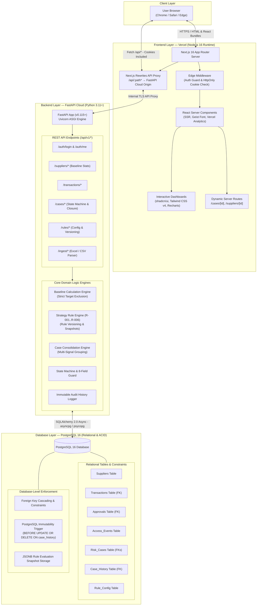

# 🛡️ Trust & Risk Intelligence System (TRIS)

**Enterprise Financial Fraud Detection, Supplier Risk Intelligence & Internal Control Auditing**

[-black?style=for-the-badge&logo=vercel)](https://vercel.com)
[-009688?style=for-the-badge&logo=fastapi)](https://fastapi.tiangolo.com)
[](https://www.postgresql.org)

---

## 📖 Overview

The **Trust & Risk Intelligence System (TRIS)** is a specialized risk intelligence platform engineered for enterprise supply chain operations, manufacturing procurement, and corporate finance audit teams. 

Traditional fraud monitoring systems rely either on brittle, disconnected filters or opaque "black-box" AI models that output unexplainable percentages (e.g., *"96.8% accuracy"*). TRIS replaces these with **Explainability by Construction**: every alert, score, and investigation case is strictly backed by deterministic mathematical deviations, cross-vector data correlation, and an immutable audit trail.

### 🌟 Core Architectural Pillars

1. **Zero Fake Metrics (Mathematical Explainability)**: Eliminates fabricated AI confidence percentages. Anomalies are mathematically proven against supplier historical baselines that strictly exclude the evaluated transaction.
2. **Multi-Vector Telemetry Correlation**: Correlates four distinct enterprise domains in real time: Accounts Payable Invoices, Vendor Master Bank Modifications, Identity & Access Event Logs, and Hierarchical Approval Thresholds.
3. **Configurable Strategy Rule Engine**: Modular, version-tracked rule catalog (`R-001` through `R-006`) with runtime threshold adjustments and JSONB evaluation snapshots.
4. **Enforced Verified Closure Gatekeeper**: A state machine that strictly prohibits closing risk cases without 8 mandatory compliance fields (root cause, corrective action, closure type, evidence ID, named verifier, closure date, follow-up requirement, and 90-day recurrence monitoring).
5. **Database-Level Immutability**: PostgreSQL engine triggers prevent `UPDATE` or `DELETE` operations on the audit history table, guaranteeing compliance integrity.

---

## 🏛️ High-Level System Architecture

TRIS uses a modern, decoupled split-cloud architecture: the Next.js 16 App Router on Vercel delivers high-velocity UI and dynamic server rendering, while the FastAPI Cloud backend executes statistical calculations, rule evaluation pipelines, and database operations. Next.js internal `rewrites` transparently proxy API traffic to eliminate browser CORS friction:



---

## 📑 Core Documentation Index

| Document | Purpose & Contents |
| :--- | :--- |
| **[`AGENTS.md`](./AGENTS.md)** | **Developer & Agent Guidelines**: Strict 4-layer module boundaries (routes max 50 lines, services raise domain exceptions, models SQLModel only, schemas Pydantic), standard response payloads, Argon2 security, and developer workflows. |
| **[`architecture.md`](./architecture.md)** | **System Architecture Specification**: Deployment topology, pictorial database ERD, networking proxy flow, rule engine design, state machine transitions, and ADR summaries. |
| **[`solution.md`](./solution.md)** | **Solution Design & Problem-to-Value Mapping**: Problem statement, the 4 architectural pillars, complete walkthrough of `TEST-CASE-001`, and developer acceptance matrix (`T01`-`T10`). |
| **[`backend/backend.md`](./backend/backend.md)** | **Backend Architecture & Implementation Guide**: Technology stack, modular directory layout (`modules/v1/`), service contracts, custom exceptions, response utilities, and REST API catalog. |
| **[`docs/v1_3_SCOPE_SPECIFICATION.md`](./docs/v1_3_SCOPE_SPECIFICATION.md)** | **TRIS v1.3 Build Specification**: Full requirements, architectural boundaries, minimum screens, and acceptance criteria extracted from `tris updated.pdf`. |
| **[`docs/SYNTHETIC_TEST_DATA.md`](./docs/SYNTHETIC_TEST_DATA.md)** | **Synthetic Test Data Reference**: Complete tabular tables extracted from `test data.xlsx` across all 8 sheets with mathematical baseline proofs. |
| **[`docs/ARCHITECTURE_DECISIONS_AND_ROADMAP.md`](./docs/ARCHITECTURE_DECISIONS_AND_ROADMAP.md)** | **Architecture Decision Records (ADRs) & Engineering Roadmap**: Formal ADRs (ADR-001 through ADR-008) with Senior Principal Engineer review log and granular phase trackers. |
| **[`docs/MILESTONE_1_TECHNICAL_ASSESSMENT.md`](./docs/MILESTONE_1_TECHNICAL_ASSESSMENT.md)** | **Milestone 1 Technical Assessment**: In-depth answers to pre-development questions, code audit findings, and verification alignment. |

---

## 🚀 Quick Start (Local Development)

### Prerequisites
- Node.js `20.x` or `22.x`
- Python `3.11` or `3.12`
- [`uv`](https://github.com/astral-sh/uv)
- Docker & Docker Compose (for PostgreSQL 16)

### 1. Database Setup
```bash
docker compose up -d postgres
```

### 2. Backend Setup
```bash
cd backend
uv sync
# Windows PowerShell:
.venv\Scripts\Activate.ps1
# Linux / macOS: source .venv/bin/activate
uv run alembic upgrade head
uv run python -m app.scripts.seed --data-file "../test data.xlsx"
uv run fastapi dev app/main.py --port 8000
```
Interactive API documentation: `http://127.0.0.1:8000/docs`

### 3. Frontend Setup
```bash
# In project root:
npm install
npm run dev
```
Open `http://localhost:3000` in your browser.