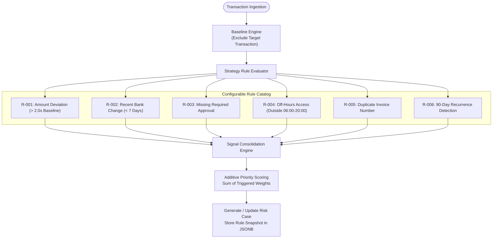
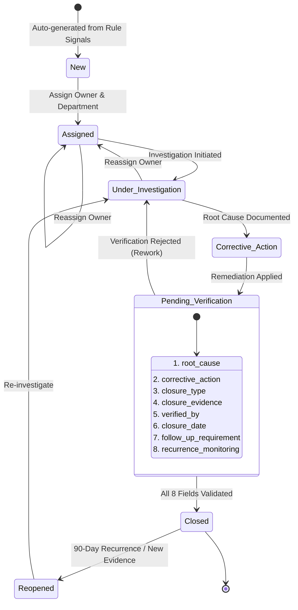

# 🏛️ TRIS System Architecture Specification

**System**: Trust & Risk Intelligence System (TRIS)  
**Version**: 1.3 (Synthetic-Data Driven Architecture)  
**Classification**: Enterprise Architectural Blueprint & Systems Specification  
**Status**: ACTIVE & SIGNED OFF  

---

## 1. Executive Summary & Architectural Goals

The Trust & Risk Intelligence System (TRIS) is a specialized enterprise platform built to detect sophisticated supply chain fraud, financial control bypasses, and vendor risk anomalies. Unlike conventional "black-box" AI systems that generate unexplainable risk scores, TRIS is engineered around **Explainability by Construction**: every alert, score, and investigation case is strictly backed by deterministic mathematical calculations and verifiable relational data points.

### Core Architectural Goals
1. **Explainability by Construction**: Eliminate synthetic metrics, artificial precision numbers, and unverified AI outputs. Every anomaly is mathematically explainable.
2. **Defensive Data Integrity**: Strict PostgreSQL foreign keys, non-nullable constraints, and engine-level triggers enforce integrity across transactions, approvals, and audit records.
3. **Decoupled Modern Stack**: High-velocity frontend deployed on **Vercel** (Next.js 16 App Router with full Node.js runtime) communicating seamlessly with a high-performance numerical backend deployed on **FastAPI Cloud** (Python 3.11+).
4. **Deterministic Rule Engine**: Strategy-pattern evaluation pipeline supporting runtime threshold configuration (`RuleConfig`) and immutable rule versioning.
5. **Auditable Lifecycle Governance**: Strict server-enforced state machine requiring an 8-field verified closure gate before risk cases can be resolved.

---

## 2. High-Level System Architecture & Deployment Topology

TRIS operates on a split-cloud topology. The client interacts with the Vercel edge/Node.js layer, which serves the interactive dashboard and transparently proxies all `/api/*` traffic to the FastAPI Cloud backend origin via Next.js internal rewrites:

```mermaid
flowchart TB
    subgraph ClientLayer ["Client Tier"]
        Browser["User Browser<br/>(Desktop / Tablet)"]
    end

    subgraph VercelHost ["Frontend Tier — Vercel (Next.js 16 Node.js Runtime)"]
        NextCore["Next.js 16 App Router Engine"]
        RSC["React Server Components<br/>(SSR, Geist Font, Vercel Analytics)"]
        ClientUI["Interactive Client Components<br/>(shadcn/ui, Tailwind CSS v4, Recharts)"]
        DynRoutes["Dynamic Routing Engine<br/>/cases/[id], /suppliers/[id]"]
        AuthMiddleware["Edge Middleware<br/>(Auth Guard & HttpOnly Cookie Forwarding)"]
        RewritesProxy["Next.js Rewrites API Proxy<br/>/api/:path* → FastAPI Cloud Origin"]

        NextCore --> AuthMiddleware
        AuthMiddleware --> RSC
        RSC --> ClientUI
        RSC --> DynRoutes
        NextCore --> RewritesProxy
    end

    subgraph FastAPIHost ["Backend Tier — FastAPI Cloud (Python 3.11+)"]
        ASGI["FastAPI App (v0.115+)<br/>Uvicorn ASGI Engine"]

        subgraph APIRoutes ["REST API Endpoints (/api/v1/*)"]
            AuthAPI["/auth/login & /auth/me"]
            SuppliersAPI["/suppliers/* (Baseline Statistics)"]
            TxAPI["/transactions/*"]
            CasesAPI["/cases/* (State Machine & 8-Field Closure)"]
            RulesAPI["/rules/* (Config & Versioning)"]
            IngestAPI["/ingest/* (Excel & CSV Parsing)"]
        end

        subgraph ProcessingEngines ["Core Domain Logic Engines"]
            BaselineEngine["Baseline Analytics Engine<br/>(Strict Target Exclusion Logic)"]
            RuleEngine["Modular Strategy Rule Engine<br/>(Rules R-001 through R-006)"]
            ConsolidationEngine["Multi-Signal Case Consolidation"]
            StateMachine["Case Lifecycle State Machine"]
            AuditLogger["Append-Only Case History Logger"]
        end

        ASGI --> APIRoutes
        APIRoutes --> ProcessingEngines
    end

    subgraph DatabaseTier ["Database Tier — PostgreSQL 16 (ACID & Relational)"]
        PG[("PostgreSQL 16 Relational Engine")]

        subgraph DataTables ["Relational Schema"]
            T_Suppliers["Suppliers"]
            T_Transactions["Transactions (FK: supplier_id)"]
            T_Approvals["Approvals (FK: transaction_id)"]
            T_AccessEvents["Access_Events"]
            T_RiskCases["Risk_Cases (FKs: supplier_id, transaction_id)"]
            T_CaseHistory["Case_History (FK: case_id)"]
            T_RuleConfig["Rule_Config"]
        end

        subgraph ConstraintsAndTriggers ["Engine-Level Enforcement"]
            FKConstraints["Foreign Key Constraints & Cascades"]
            ImmutabilityTrigger["PostgreSQL Immutability Trigger<br/>(BEFORE UPDATE OR DELETE ON Case_History)"]
            JSONBSnapshots["JSONB Evaluation Snapshots"]
        end

        PG --- DataTables
        PG --- ConstraintsAndTriggers
    end

    Browser <-->|HTTPS / HTML & React Bundles| NextCore
    Browser <-->|API Requests (HttpOnly Cookies)| RewritesProxy
    RewritesProxy <-->|Internal TLS Proxy| ASGI
    ProcessingEngines <-->|SQLAlchemy 2.0 Async (asyncpg / psycopg)| PG
```

---

## 3. Pictorial Database Entity-Relationship Diagram (ERD)

The relational schema is normalized to 3NF and enforces relational integrity across all financial, operational, and audit entities:

```mermaid
erDiagram
    SUPPLIERS ||--o{ TRANSACTIONS : "issues (1:N)"
    SUPPLIERS ||--o{ RISK_CASES : "subject of (1:N)"
    TRANSACTIONS ||--o{ APPROVALS : "requires (1:N)"
    TRANSACTIONS ||--o{ RISK_CASES : "triggers (1:N)"
    RISK_CASES ||--|{ CASE_HISTORY : "tracks audit (1:N)"
    RULE_CONFIG ||--o{ RISK_CASES : "evaluates into (1:N)"

    SUPPLIERS {
        string supplier_id PK "SUP-001"
        string name "Northstar Components LLC"
        string category "Electrical Components"
        string risk_tier "Medium"
        string bank_account "NL91ABNA0417164300"
        string routing_number "021000021"
        date bank_change_date "2026-08-20"
        string status "Active"
    }

    TRANSACTIONS {
        string transaction_id PK "TX-1999"
        string supplier_id FK "SUP-001"
        string invoice_number "INV-2026-089"
        float amount "104000.00"
        string currency "USD"
        date invoice_date "2026-08-22"
        date due_date "2026-09-22"
        string payment_status "Pending"
    }

    APPROVALS {
        string approval_id PK "AP-1999"
        string transaction_id FK "TX-1999"
        string required_level "Level 3"
        string approver_name "Sarah Chen"
        string approver_role "CFO"
        string approval_status "Missing"
        datetime timestamp "2026-08-22T14:30:00Z"
    }

    ACCESS_EVENTS {
        string event_id PK "AE-003"
        string user_id "usr-finance-04"
        string user_name "Sarah Chen"
        datetime timestamp "2026-08-22T22:47:00Z"
        string system_area "Payment Batch Processing"
        string action "Approve Batch"
        string ip_address "192.168.1.105"
        boolean flagged "true"
    }

    RISK_CASES {
        string case_id PK "TEST-CASE-001"
        string case_number "CASE-2026-0001"
        string priority "High"
        string status "New"
        string supplier_id FK "SUP-001"
        string transaction_id FK "TX-1999"
        string assigned_to "A. Reviewer"
        string department "Finance"
        jsonb trigger_signals "Array of rule triggers"
        jsonb evaluation_snapshot "Version, weights & baseline at eval time"
        string root_cause "Root cause narrative"
        string corrective_action "Remediation narrative"
        string closure_type "Financial/Control"
        string closure_evidence "DOC-TEST-001"
        string verified_by "B. Verifier"
        datetime closure_date "2026-08-31T16:00:00Z"
        string follow_up_requirement "Quarterly review"
        string recurrence_monitoring "90 days"
    }

    CASE_HISTORY {
        int history_id PK "Auto-increment ID"
        string case_id FK "TEST-CASE-001"
        datetime timestamp "2026-08-23T09:00:00Z"
        string actor "A. Reviewer"
        string action "Status Change"
        string previous_status "New"
        string new_status "Assigned"
        string note "Assigned to Finance review queue"
    }

    RULE_CONFIG {
        int rule_id PK "1"
        string rule_code "R-001"
        string name "Amount Deviation"
        string description "Invoice exceeds multiplier x historical baseline"
        int weight "35"
        jsonb threshold_params "{\"multiplier\": 2.0}"
        int rule_version "1"
        boolean is_active "true"
    }
```

---

## 4. Subsystem Architectural Specifications

### 4.1 Networking & Proxy Architecture
- **Production Routing**: Next.js `rewrites` configured in `frontend/next.config.mjs` maps `/api/:path*` to the FastAPI Cloud backend origin. The client browser communicates exclusively with the Vercel host, completely bypassing CORS preflight overhead and cross-site cookie restrictions.
- **Session Forwarding**: Authentication tokens are issued as HttpOnly `SameSite=Lax` cookies. The Next.js reverse proxy automatically forwards incoming cookies to the FastAPI Cloud origin.
- **Development Routing**: Next.js dev server (`localhost:3000`) mirrors this exact pattern, proxying `/api/*` to FastAPI on `localhost:8000`.

### 4.2 Deterministic Rule Engine Pipeline
The Rule Engine employs the **Strategy Pattern**, evaluating incoming financial events through independent, decoupled rule classes implementing a common contract:

$$\text{Evaluate}(C) \longrightarrow \text{RuleResult}(\text{Triggered}, \text{Weight}, \text{Reason}, \text{Evidence})$$



#### Additive Scoring Formula
$$\text{Composite Score} = \sum_{i \in \text{Triggered}} \text{Weight}(R_i)$$
- **Score $\ge 70$**: **HIGH** Priority (e.g., `TX-1999` triggers R-001(35) + R-002(25) + R-003(25) + R-004(15) = 100)
- **Score $30 - 69$**: **MEDIUM** Priority (e.g., `TX-4002` triggers R-005(30) = 30)
- **Score $< 30$**: **LOW** Priority

### 4.3 Case Lifecycle State Machine
The lifecycle transitions are server-enforced, rejecting illegal transitions and requiring all 8 verification fields before reaching the `Closed` terminal state:



### 4.4 Audit Trail & Immutability Architecture
- **Append-Only Table**: Every case modification generates an immutable row in `Case_History`.
- **Database Engine Guard**: A PostgreSQL `BEFORE UPDATE OR DELETE` trigger actively prevents records from being altered or deleted, even if credentials with write permissions access the database directly:
  ```sql
  CREATE OR REPLACE FUNCTION prevent_case_history_mutation()
  RETURNS TRIGGER AS $$
  BEGIN
      RAISE EXCEPTION 'Case history records are immutable and cannot be updated or deleted';
  END;
  $$ LANGUAGE plpgsql;

  CREATE TRIGGER case_history_immutable
      BEFORE UPDATE OR DELETE ON case_history
      FOR EACH ROW EXECUTE FUNCTION prevent_case_history_mutation();
  ```
- **Actor Identity**: Populated strictly from verified JWT claims (`CurrentUserDep`), preventing caller spoofing.

---

## 5. Architecture Decision Records (ADRs) Summary

| ADR # | Focus Area | Selected Decision | Core Rationale |
| :---: | :--- | :--- | :--- |
| **ADR-001** | Backend Framework | **FastAPI (Python 3.11+)** | Native numerical ecosystem (Pandas/NumPy), Rust-backed Pydantic v2 validation, native async. |
| **ADR-002** | Database & ORM | **PostgreSQL 16 + SQLAlchemy 2.0 (async)** | Relational ACID guarantees, JSONB snapshots, DB triggers, pure separation between DB models and Pydantic DTOs. |
| **ADR-003** | Deployment Model | **Vercel (Frontend) + FastAPI Cloud (Backend)** | Full Node.js runtime on Vercel enables SSR, dynamic routes (`/cases/[id]`), Edge Middleware, Geist font; FastAPI Cloud handles compute. |
| **ADR-004** | Rule Engine Design | **Strategy Pattern with Versioning** | Isolated rule classes, DB-backed thresholds (`RuleConfig`), rule version tracking, JSONB evaluation snapshots. |
| **ADR-005** | Case State Machine | **Server-Enforced State Machine** | Strict API-level validation of 8 mandatory fields before closure; explicit reject and reopen transition pathways. |
| **ADR-006** | Audit Trail | **Database-Enforced Immutability** | PostgreSQL triggers block UPDATE/DELETE on `Case_History`; actor identity bound to authenticated JWT. |
| **ADR-007** | Authentication | **JWT with HttpOnly Secure Cookies** | Stateless backend verification on FastAPI Cloud; Next.js Middleware route guarding and cookie forwarding. |
| **ADR-008** | CORS & Security | **Next.js Rewrites Reverse Proxy** | Proxies `/api/*` to backend origin, eliminating browser CORS friction; includes standard enterprise security headers. |
