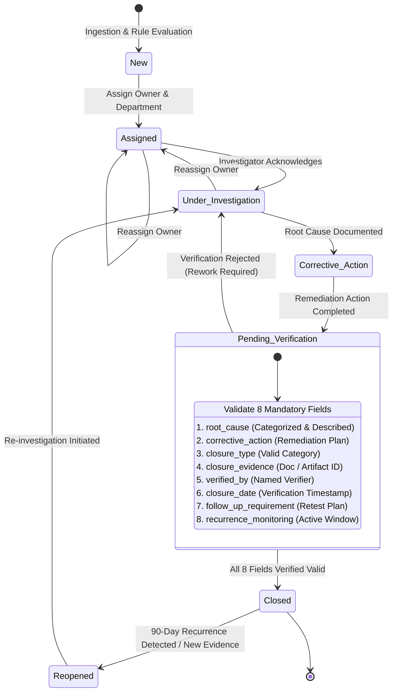
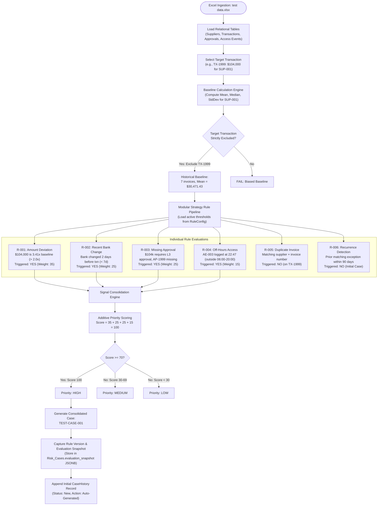
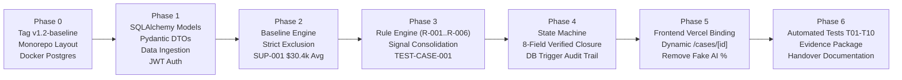

# TRIS v1.3: Architecture Decision Records (ADR) & Phased Engineering Roadmap

**System**: Trust & Risk Intelligence System (TRIS)  
**Version**: 1.3 (Synthetic-Data Driven Architecture)  
**Document Type**: Engineering Architecture Decision Record (ADR) & Milestone Tracking Blueprint  
**Revision**: 2.1 (Pictorial Database Schema, System Topology & Engine Flowcharts Added)  
**Status**: SIGNED OFF FOR EXECUTION  

---

## Table of Contents
1. [Engineering Philosophy & Principles](#1-engineering-philosophy--principles)
2. [Visual Architecture, Pictorial Database Schema & Flowcharts](#2-visual-architecture-pictorial-database-schema--flowcharts)
   - [2.1 Pictorial Database Entity-Relationship Diagram (ERD)](#21-pictorial-database-entity-relationship-diagram-erd)
   - [2.2 System Architecture & Deployment Topology](#22-system-architecture--deployment-topology)
   - [2.3 Case Lifecycle State Machine Flowchart](#23-case-lifecycle-state-machine-flowchart)
   - [2.4 Rule Engine Evaluation & Signal Consolidation Flowchart](#24-rule-engine-evaluation--signal-consolidation-flowchart)
   - [2.5 Phased Engineering Roadmap Flowchart](#25-phased-engineering-roadmap-flowchart)
3. [Architecture Decision Records (ADRs)](#3-architecture-decision-records-adrs)
   - [ADR-001: Backend Framework — FastAPI](#adr-001-backend-framework--fastapi)
   - [ADR-002: Database & ORM — PostgreSQL + SQLAlchemy 2.0 + Pydantic DTOs](#adr-002-database--orm--postgresql--sqlalchemy-20--pydantic-dtos)
   - [ADR-003: Deployment & Serving — Vercel (Frontend) + FastAPI Cloud (Backend)](#adr-003-deployment--serving--vercel-frontend--fastapi-cloud-backend)
   - [ADR-004: Deterministic Rule Engine with Versioning](#adr-004-deterministic-rule-engine-with-versioning)
   - [ADR-005: Case State Machine with Reopen/Reject Paths](#adr-005-case-state-machine-with-reopenreject-paths)
   - [ADR-006: Immutable Audit Trail — Database-Enforced](#adr-006-immutable-audit-trail--database-enforced)
   - [ADR-007: Authentication & Authorization Strategy](#adr-007-authentication--authorization-strategy)
   - [ADR-008: CORS & Security Posture](#adr-008-cors--security-posture)
   - [ADR-009: Ingestion Engine Resilience & Asynchronous Scale](#adr-009-ingestion-engine-resilience--asynchronous-scale)
   - [ADR-010: Real-Time Notification Hub & Event Alerting Architecture](#adr-010-real-time-notification-hub--event-alerting-architecture)
4. [Granular Phase Breakdown & Progress Tracker](#4-granular-phase-breakdown--progress-tracker)
5. [Risk Analysis, Tradeoffs & Mitigations](#5-risk-analysis-tradeoffs--mitigations)
6. [Principal Engineer Review Sign-Off Log](#6-principal-engineer-review-sign-off-log)

---

## 1. Engineering Philosophy & Principles

1. **Zero Fake Metrics (Explainability by Construction)**: No hardcoded percentages, artificial AI accuracy scores, or unverified probability numbers. Every alert, score, and flag must be traceable back to explicit data points and mathematical deviations.
2. **Defensive Data Integrity**: The database schema enforces referential integrity. Foreign keys, non-nullable fields, and state transitions are validated on the backend. The frontend is never trusted as a sole enforcement layer.
3. **Deterministic & Auditable**: Given the same dataset and rule configurations, the rule engine always produces the exact same case grouping, priority score, and explanation text.
4. **Single-Source Relational Truth**: Financial transactions, approvals, and access logs share interconnected schemas. No duplicated or desynchronized state.
5. **Incremental & Non-Destructive**: Baseline code is tagged and preserved. Every milestone is testable and backward-compatible.

---

## 2. Visual Architecture, Pictorial Database Schema & Flowcharts

### 2.1 Pictorial Database Entity-Relationship Diagram (ERD)

This diagram defines all core relational tables, primary keys, foreign keys, non-nullable attributes, and relational cardinalities across the TRIS v1.3 data tier:

```mermaid
erDiagram
    SUPPLIERS ||--o{ TRANSACTIONS : "issues (1:N)"
    SUPPLIERS ||--o{ RISK_CASES : "subject of (1:N)"
    TRANSACTIONS ||--o{ APPROVALS : "requires (1:N)"
    TRANSACTIONS ||--o{ RISK_CASES : "triggers (1:N)"
    RISK_CASES ||--|{ CASE_HISTORY : "tracks audit (1:N)"
    RULE_CONFIG ||--o{ RISK_CASES : "evaluates into (1:N)"

    SUPPLIERS {
        string supplier_id PK "SUP-001"
        string name "Northstar Components LLC"
        string category "Electrical Components"
        string risk_tier "Medium / Low / High"
        string bank_account "NL91ABNA0417164300"
        string routing_number "021000021"
        date bank_change_date "2026-08-20"
        string status "Active / Suspended"
    }

    TRANSACTIONS {
        string transaction_id PK "TX-1999"
        string supplier_id FK "SUP-001"
        string invoice_number "INV-2026-089"
        float amount "104000.00"
        string currency "USD"
        date invoice_date "2026-08-22"
        date due_date "2026-09-22"
        string payment_status "Pending / Paid"
    }

    APPROVALS {
        string approval_id PK "AP-1999"
        string transaction_id FK "TX-1999"
        string required_level "Level 3"
        string approver_name "Sarah Chen"
        string approver_role "CFO"
        string approval_status "Missing / Approved / Rejected"
        datetime timestamp "2026-08-22T14:30:00Z"
    }

    ACCESS_EVENTS {
        string event_id PK "AE-003"
        string user_id "usr-finance-04"
        string user_name "Sarah Chen"
        datetime timestamp "2026-08-22T22:47:00Z"
        string system_area "Payment Batch Processing"
        string action "Approve Batch"
        string ip_address "192.168.1.105"
        boolean flagged "true"
    }

    RISK_CASES {
        string case_id PK "TEST-CASE-001"
        string case_number "CASE-2026-0001"
        string priority "High / Medium / Low"
        string status "New / Assigned / Under Investigation / Corrective Action / Pending Verification / Closed / Reopened"
        string supplier_id FK "SUP-001"
        string transaction_id FK "TX-1999"
        string assigned_to "A. Reviewer"
        string department "Finance"
        jsonb trigger_signals "Array of triggered rule codes and diagnostics"
        jsonb evaluation_snapshot "Rule versions, weights, and baseline values at evaluation time"
        string root_cause "Compromised ERP credentials"
        string corrective_action "Revoked credentials and updated MFA policy"
        string closure_type "Financial/Control / Supplier / Access/Security / Compliance / Process"
        string closure_evidence "DOC-TEST-001"
        string verified_by "B. Verifier"
        datetime closure_date "2026-08-31T16:00:00Z"
        string follow_up_requirement "Retest quarterly invoice controls"
        string recurrence_monitoring "90 days active surveillance"
    }

    CASE_HISTORY {
        int history_id PK "Auto-increment ID"
        string case_id FK "TEST-CASE-001"
        datetime timestamp "2026-08-23T09:00:00Z"
        string actor "A. Reviewer (from JWT identity)"
        string action "Status Change / Note / Assignment"
        string previous_status "New"
        string new_status "Assigned"
        string note "Case assigned to Finance review queue"
    }

    RULE_CONFIG {
        int rule_id PK "1"
        string rule_code "R-001"
        string name "Amount Deviation"
        string description "Invoice exceeds multiplier x supplier historical baseline"
        int weight "35"
        jsonb threshold_params "{\"multiplier\": 2.0, \"exclude_target\": true}"
        int rule_version "1"
        boolean is_active "true"
    }
```

---

### 2.2 System Architecture & Deployment Topology

This diagram illustrates the split-deployment architecture across **Vercel** (Next.js 16 App Router) and **FastAPI Cloud** (Python 3.11+ REST API), showing how Next.js API `rewrites` eliminate browser CORS friction:

```mermaid
flowchart TB
    subgraph Client ["Client Tier"]
        Browser["User Browser<br/>(Chrome / Safari / Edge)"]
    end

    subgraph Vercel ["Frontend Layer — Vercel (Node.js 16 Runtime)"]
        NextServer["Next.js 16 App Router Server"]
        RSC["React Server Components<br/>(SSR, Geist Font, Vercel Analytics)"]
        ClientUI["Interactive Client Components<br/>(shadcn/ui, Tailwind v4, Recharts)"]
        DynRoutes["Dynamic Routes<br/>/cases/[id], /suppliers/[id]"]
        Middleware["Edge Middleware<br/>(Auth Guard & HttpOnly Cookie Check)"]
        Proxy["Next.js Rewrites Proxy<br/>/api/:path* → FastAPI Cloud Origin"]
        
        NextServer --> Middleware
        Middleware --> RSC
        RSC --> ClientUI
        RSC --> DynRoutes
        NextServer --> Proxy
    end

    subgraph BackendHost ["Backend Layer — FastAPI Cloud (Python 3.11+)"]
        API["FastAPI App (v0.115+)<br/>Uvicorn ASGI Engine"]
        
        subgraph Endpoints ["REST API Endpoints (/api/v1/*)"]
            AuthEP["/auth/login & /auth/me"]
            SuppliersEP["/suppliers/* (Baseline Stats)"]
            TxEP["/transactions/*"]
            CasesEP["/cases/* (State Machine & Closure)"]
            RulesEP["/rules/* (Config & Versioning)"]
            IngestEP["/ingest/* (Excel / CSV Parser)"]
        end
        
        subgraph CoreEngines ["Core Domain Logic Engines"]
            BaselineEng["Baseline Calculation Engine<br/>(Strict Target Exclusion)"]
            RuleEng["Strategy Rule Engine (R-001..R-006)<br/>(Rule Versioning & Snapshots)"]
            ConsolidationEng["Case Consolidation Engine<br/>(Multi-Signal Grouping)"]
            StateMachineEng["State Machine & 8-Field Guard"]
            AuditEng["Immutable Audit History Logger"]
        end
        
        API --> Endpoints
        Endpoints --> CoreEngines
    end

    subgraph DatabaseHost ["Database Layer — PostgreSQL 16 (Relational & ACID)"]
        PG[("PostgreSQL 16 Database")]
        
        subgraph RelationalSchema ["Relational Tables & Constraints"]
            T_Suppliers["Suppliers Table"]
            T_Transactions["Transactions Table (FK)"]
            T_Approvals["Approvals Table (FK)"]
            T_AccessEvents["Access_Events Table"]
            T_RiskCases["Risk_Cases Table (FKs)"]
            T_CaseHistory["Case_History Table (FK)"]
            T_RuleConfig["Rule_Config Table"]
        end
        
        subgraph Enforcement ["Database-Level Enforcement"]
            FK_Const["Foreign Key Cascading & Constraints"]
            Trigger["PostgreSQL Immutability Trigger<br/>(BEFORE UPDATE OR DELETE ON case_history)"]
            JSONB_Snap["JSONB Rule Evaluation Snapshot Storage"]
        end
        
        PG --- RelationalSchema
        PG --- Enforcement
    end

    Browser <-->|HTTPS / HTML & React Bundles| NextServer
    Browser <-->|Fetch /api/* (Cookies Included)| Proxy
    Proxy <-->|Internal TLS API Proxy| API
    CoreEngines <-->|SQLAlchemy 2.0 Async (asyncpg / psycopg)| PG
```

---

### 2.3 Case Lifecycle State Machine Flowchart

This state diagram details all allowed state transitions, including reassignment, verification rejection, 90-day recurrence reopening, and the server-enforced **8-Field Verified Closure Guard**:



---

### 2.4 Rule Engine Evaluation & Signal Consolidation Flowchart

This flowchart outlines the end-to-end evaluation pipeline from Excel ingestion to signal consolidation into `TEST-CASE-001`:



---

### 2.5 Phased Engineering Roadmap Flowchart



---

## 3. Architecture Decision Records (ADRs)

### ADR-001: Backend Framework — FastAPI

* **Decision**: Use **FastAPI (Python 3.11+)** with Pydantic v2 and Uvicorn.
* **Context**: We need a backend capable of complex numerical baseline calculations, Excel/CSV ingestion, deterministic rule evaluation, and clean REST API design.
* **Why FastAPI?**:
  - **Native Data & Numerical Ecosystem**: Python provides first-class libraries (`pandas`, `numpy`, `openpyxl`) for calculating rolling medians, quantile deviations, and spreadsheet parsing directly in-memory without microservice overhead.
  - **Type Safety & Auto-Documentation**: Pydantic v2 (compiled in Rust) provides schema validation, fast serialization, and automatic OpenAPI / Swagger interactive documentation (`/docs`).
  - **Modern Async Architecture**: Native asynchronous request handling via `asyncio` for high-throughput database interactions.
  - **FastAPI Cloud Deployment**: First-class deployment target with zero-config scaling.
* **Why Not Node.js / Express / NestJS?**:
  - JavaScript lacks a mature, standardized equivalent to Pandas/NumPy for statistical baseline processing and Excel data transformation.
  - Requires separate microservices or third-party bindings for advanced data analytics.
* **Why Not Django?**:
  - Django includes excessive monolithic baggage (Django Admin, session tables, Django templates) that conflicts with our decoupled SPA architecture.
  - Slower execution overhead and cumbersome async ORM ergonomics compared to FastAPI.
* **Why Not Go / Gin?**:
  - While Go offers extreme concurrency, its tabular data manipulation and spreadsheet ingestion ecosystem requires substantially more boilerplate for dynamic rule analysis.

---

### ADR-002: Database & ORM — PostgreSQL + SQLAlchemy 2.0 + Pydantic DTOs

* **Decision**: Use **PostgreSQL** with **SQLAlchemy 2.0 (async)** for database models and **separate Pydantic v2 schemas** for API request/response DTOs. Use **Alembic** for migrations.
* **Context**: The TRIS data model involves strict relationships: Suppliers -> Transactions -> Approvals -> Access Events -> Risk Cases -> Case History.

> **Revision Note (from Principal Engineer Review)**: The original plan used SQLModel to unify database models and API schemas in a single class. This was rejected because:
> 1. SQLModel's Pydantic v2 compatibility is incomplete — complex validators (`field_validator`, `model_validator`) behave inconsistently.
> 2. Single-class unification creates leaky abstractions — internal DB fields (auto-increment IDs, timestamps) leak into API responses unless manually excluded.
> 3. Separate `Create`, `Update`, and `Response` schemas would be needed anyway, negating the supposed benefit.
>
> **Corrected Approach**: Use pure SQLAlchemy 2.0 declarative models for the database layer and dedicated Pydantic v2 schemas (`schemas/`) for API DTOs. This provides clean separation of concerns with no abstraction leakage.

* **Why PostgreSQL?**:
  - **Strict Referential Integrity**: ACID compliance and foreign key cascading prevent orphaned transactions, fake approvals, or unlinked case histories.
  - **Time-Series & Analytics Friendly**: High performance for date-range queries, lookback windows (e.g. 7-day bank change, 90-day recurrence), and aggregate window functions.
  - **JSONB Support**: Native JSONB columns for storing rule evaluation snapshots and flexible evidence metadata.
  - **Database-Level Triggers**: PostgreSQL triggers can enforce immutability on audit trail tables at the engine level.
* **Why Not MongoDB / NoSQL?**:
  - Document databases do not enforce relational integrity at the engine level. In financial compliance, orphaned records or inconsistent transaction-approval states can lead to catastrophic auditing failures.
* **Why Not Prisma (Python)?**:
  - Prisma Python relies on a Node.js/Rust query engine child process, introducing operational complexity compared to native Python DB drivers (`psycopg` / `asyncpg`).

> **Revision Note**: The original plan included a SQLite dev fallback. This was rejected because SQLite and PostgreSQL have different behaviors for DATETIME handling, foreign key enforcement (requires `PRAGMA foreign_keys = ON`), JSON support, and concurrent write locking. A test passing on SQLite can fail on PostgreSQL. **Use Docker Compose for local PostgreSQL** — three lines of YAML eliminates the entire divergence risk.

---

### ADR-003: Deployment & Serving — Vercel (Frontend) + FastAPI Cloud (Backend)

* **Decision**: **Split deployment** — Next.js 16 deployed on **Vercel** (full Node.js runtime), FastAPI deployed on **FastAPI Cloud** (pure Python API service).
* **Context**: We want each layer deployed on its optimal platform without compromising capabilities.

> **Revision Note (from Principal Engineer Review)**: The original plan used `output: 'export'` to generate a static SPA served by FastAPI. This was rejected because:
> 1. Dynamic routes like `/cases/[id]` cannot be statically pre-rendered — case IDs are generated at runtime by the rule engine.
> 2. `next/font/google` (Geist font in `layout.tsx`) requires Node.js build infrastructure.
> 3. `@vercel/analytics` requires Vercel hosting.
> 4. Static export disables Server Components, Middleware, Route Handlers, and streaming — sacrificing the entire React 19 / Next.js 16 advantage.
>
> **Corrected Approach**: Deploy Next.js to Vercel with full Node.js runtime. All Next.js capabilities preserved.

* **Routing Strategy**:
  - **Static Routes** (pre-rendered at build time): `/`, `/login`, `/compliance`, `/fraud-detection`, `/suppliers`, `/zero-trust`, `/dashboard/settings`, `/dashboard/reports`, `/dashboard/correlation`.
  - **Dynamic Routes** (server-rendered per request): `/cases/[id]` (case detail), `/suppliers/[id]/baseline` (supplier drill-down), `/ingestion` (live upload status), `/developer-tests` (live test execution status).
  - **API Proxy**: Next.js `rewrites` in `next.config.mjs` proxies `/api/*` requests to FastAPI Cloud origin, eliminating CORS issues in production.
  - **Middleware**: `middleware.ts` handles auth guard redirects (unauthenticated users -> `/login`).

* **Development Mode**:
  - Next.js dev server on `localhost:3000` with `rewrites` proxying `/api/*` to FastAPI on `localhost:8000`.
  - FastAPI runs locally via `fastapi dev` with hot-reload.
  - **No CORS friction**: The proxy means the browser only sees `localhost:3000` as the origin.

* **Production Mode**:
  - Vercel rewrites `/api/*` to the FastAPI Cloud origin URL (configured in `vercel.json` or `next.config.mjs` rewrites).
  - Single domain from the browser's perspective — no CORS issues.

---

### ADR-004: Deterministic Rule Engine with Versioning

* **Decision**: Modular **Strategy Pattern Rule Engine** with database-driven threshold configurations (`RuleConfig`) and **evaluation snapshot versioning**.
* **Context**: Rules `R-001` through `R-006` must be configurable, explainable, testable in isolation, and historically traceable.

> **Revision Note (from Principal Engineer Review)**: The original design stored rule thresholds in `RuleConfig` but had no concept of rule **versions**. If someone changes the `R-001` threshold from 2.0x to 1.5x, historical cases become unexplainable because the rules that produced them have been overwritten.
>
> **Correction**: Add a `rule_version` integer to `RuleConfig` (auto-incremented on threshold changes). Store an `evaluation_snapshot` JSONB column on each `RiskCase` capturing the exact rule parameters, weights, and computed values used at evaluation time.

* **Implementation**:
  - Each rule is implemented as an independent class implementing: `evaluate(context: EvaluationContext) -> RuleResult`.
  - Returns structured diagnostics: `{ triggered: bool, weight: int, reason: str, evidence: dict }`.
  - Threshold parameters (e.g. 2.0x multiplier, 7 days lookback, 06:00-20:00 window, 90 days recurrence) are stored in the database.
  - On every evaluation, the active rule parameters are snapshotted into the generated case record.

* **Priority Scoring Algorithm**:
  - Composite score = sum of weights for all triggered rules.
  - `R-001` = 35, `R-002` = 25, `R-003` = 25, `R-004` = 15, `R-005` = 30, `R-006` = 20.
  - Priority classification: Score >= 70 = **High**, Score >= 30 = **Medium**, Score < 30 = **Low**.
  - Example: `TX-1999` triggers R-001(35) + R-002(25) + R-003(25) + R-004(15) = **100 -> High**.
  - Example: `TX-4002` triggers R-005(30) = **30 -> Medium**.
  - These thresholds are stored in `RuleConfig` and adjustable via API.

---

### ADR-005: Case State Machine with Reopen/Reject Paths

* **Decision**: **Server-Enforced State Machine** with mandatory 8-field verification validation before `Closed`, plus reject and dual reopen transitions. For full governance, role boundaries, and SoD specifications, refer to [`docs/CASE_LIFECYCLE_AND_GOVERNANCE_SPECIFICATION.md`](CASE_LIFECYCLE_AND_GOVERNANCE_SPECIFICATION.md).

> **Revision Note (from Principal Engineer Review)**: The original design was strictly linear with no way to reject verification or reopen closed cases. This has been corrected.

* **Complete State Transition Table**:

| From State | Allowed Transitions | Trigger |
| :--- | :--- | :--- |
| `New` | `Assigned` | Owner and department assigned |
| `Assigned` | `Under Investigation` | Investigation initiated |
| `Assigned` | `Assigned` | Reassignment to different owner |
| `Under Investigation` | `Corrective Action` | Root cause documented, plan created |
| `Under Investigation` | `Assigned` | Reassignment to different owner |
| `Corrective Action` | `Pending Verification` | Corrective action completed, submitted for review |
| `Pending Verification` | `Closed` | All 8 verification fields validated |
| `Pending Verification` | `Under Investigation` | Verification rejected — returned for rework |
| `Closed` | `Reopened` | Recurrence detected or new evidence surfaces |
| `Reopened` | `Under Investigation` | Re-investigation initiated (`Resume Investigation`) |
| `Reopened` | `Pending Verification` | Fast-track re-verification (`Submit for Re-Verification`) |

* **Verified Closure Guard (8 Mandatory Fields)**:
  The API endpoint `POST /api/v1/cases/{id}/close` strictly rejects any request where any of these is null or empty:
  1. `root_cause` — Category and detailed description.
  2. `corrective_action` — Specific remediation action.
  3. `closure_type` — One of: Financial/Control, Supplier, Access/Security, Compliance, Process.
  4. `closure_evidence` — Document or artifact reference (e.g., `DOC-TEST-001`).
  5. `verified_by` — Named verifier (e.g., `B. Verifier`).
  6. `closure_date` — Verification timestamp.
  7. `follow_up_requirement` — Retest or follow-up plan.
  8. `recurrence_monitoring` — Active monitoring window (e.g., 90 days).

---

### ADR-006: Immutable Audit Trail — Database-Enforced

* **Decision**: Dedicated **`Case_History` table** with immutability enforced at **both** the API level and the **database engine level** via PostgreSQL triggers.

> **Revision Note (from Principal Engineer Review)**: The original design enforced immutability only at the API level. Any developer with database credentials could `UPDATE` or `DELETE` rows directly. In a compliance system, this is an audit risk.
>
> **Correction**: Add a PostgreSQL trigger that prevents UPDATE and DELETE operations on the `case_history` table at the database engine level:
> ```sql
> CREATE OR REPLACE FUNCTION prevent_case_history_mutation()
> RETURNS TRIGGER AS $$
> BEGIN
>     RAISE EXCEPTION 'Case history records are immutable and cannot be modified or deleted';
> END;
> $$ LANGUAGE plpgsql;
>
> CREATE TRIGGER case_history_immutable
>     BEFORE UPDATE OR DELETE ON case_history
>     FOR EACH ROW EXECUTE FUNCTION prevent_case_history_mutation();
> ```

* **Implementation**:
  - Any state change, reassignment, note addition, or closure writes an immutable row: `{ history_id, case_id, timestamp, actor, action, previous_status, new_status, note }`.
  - The `actor` field is populated from the verified authentication identity (see ADR-007), not from an unverified frontend payload.

---

### ADR-007: Authentication & Authorization Strategy

* **Decision**: **JWT-based authentication** with HttpOnly secure cookies for session management.
* **Context**: Without authentication, any user or script can call protected endpoints directly. The "Verified Closure Guard" (ADR-005) and the `Case_History.actor` field (ADR-006) are both meaningless without verified caller identity.

* **v1.3 Implementation (Synthetic Data Phase)**:
  - FastAPI issues a signed JWT token on successful login via `POST /api/v1/auth/login`.
  - The JWT contains: `{ user_id, email, role, department, exp }`.
  - All protected endpoints require a valid JWT via a FastAPI dependency (`Annotated[User, Depends(get_current_user)]`).
  - The `actor` field in `CaseHistory` is populated from the JWT's verified identity.
  - RBAC enforcement is documented as a future milestone but the JWT infrastructure supports it from day one.

* **Frontend Integration**:
  - Next.js stores the JWT in an HttpOnly cookie (set by FastAPI with `SameSite=Lax`).
  - Next.js middleware (`middleware.ts`) checks for the cookie and redirects unauthenticated users to `/login`.
  - API requests from Next.js server components include the cookie automatically.
  - API requests from client components use `fetch` with `credentials: 'include'`.

---

### ADR-008: CORS & Security Posture

* **Decision**: Use **Next.js rewrites as an API proxy** to eliminate CORS entirely in production. Configure explicit CORS middleware in FastAPI for direct API access and development fallback.

* **Production (Vercel + FastAPI Cloud)**:
  - Vercel rewrites proxy `/api/*` to FastAPI Cloud. The browser only sees the Vercel domain — no cross-origin requests, no CORS headers needed.
  - This is the cleanest approach: zero CORS friction, secure by default.

* **Development (localhost)**:
  - Next.js dev server rewrites `/api/*` to `localhost:8000` — same proxy approach, no CORS needed.
  - As a fallback (e.g., testing FastAPI directly via Swagger UI), FastAPI CORS middleware allows `http://localhost:3000`.

* **FastAPI CORS Configuration**:
  ```python
  from fastapi.middleware.cors import CORSMiddleware

  app.add_middleware(
      CORSMiddleware,
      allow_origins=["http://localhost:3000"],  # Dev only
      allow_credentials=True,
      allow_methods=["*"],
      allow_headers=["*"],
  )
  ```

---

### ADR-009: Ingestion Engine Resilience & Asynchronous Scale

* **Status**: ACCEPTED & SIGNED OFF  
* **Context**: The synthetic Excel ingestion pipeline was originally a synchronous HTTP handler executing N+1 queries per row and lacking error isolation. Uploading large multi-sheet workbooks blocked client threads, risked proxy timeouts (nginx/Cloudflare), and aborted completely upon any single malformed cell.
* **Decision**: 
  1. **Asynchronous Hand-off**: Migrate `POST /api/v1/ingest/upload` to return `202 Accepted` with a tracking `job_id`, delegating file processing to FastAPI `BackgroundTasks` for v1.3. Provide a telemetry endpoint (`GET /api/v1/ingest/jobs/{job_id}`) for live polling.
  2. **Row-Level Error Isolation & 20% Circuit Breaker**: Individual row validation failures append to an `error_log` without rolling back valid records. If validation failures exceed **20% of rows** on a sheet with >= 10 rows, a **Circuit Breaker** trips, aborting that sheet to prevent database pollution. Hard decision: **YES**.
  3. **Batch PK Pre-Fetch**: Replace per-row `session.get(Model, pk)` with a single `select(Model.pk).where(Model.pk.in_(...))` per sheet, reducing network roundtrips from O(N) to O(1).
  4. **Multi-Tier Sanitization**: Strip non-printable ASCII control characters (`[\x00-\x08\x0b\x0c\x0e-\x1f\x7f]`), escape HTML entities, and truncate strictly to column `max_length`.
  5. **Configurable Duplicate Handling**: Support `skip` (default idempotent safe mode), `update` (upsert), and `fail` modes via query parameters.
  6. **Future Migration Pathway (v1.4+)**: Migrate from in-process `BackgroundTasks` to Redis + `arq` when scaling horizontally across multi-container instances.
* **Full Specification**: See dedicated architecture blueprint in [`docs/INGESTION_ARCHITECTURE_AND_RESILIENCE_PLAN.md`](./INGESTION_ARCHITECTURE_AND_RESILIENCE_PLAN.md).

---

### ADR-010: Real-Time Notification Hub & Event Alerting Architecture

* **Status**: ACCEPTED & IMPLEMENTED  
* **Context**: Prior to v1.3, notification management was non-functional and rendered static client-side fixtures (`sampleNotifications`). As TRIS handles automated risk anomaly detection, background file ingestion workflows, and zero-trust security events, operators required a persistent, role-scoped notification hub to act upon critical system events in real time.
* **Decision**:
  1. **Relational PostgreSQL Persistence (`Notification` Table)**: Persist all notifications in a dedicated table with composite indexes on `(recipient_user_id, is_read)`, `(recipient_role, is_read)`, and `created_at DESC` for sub-millisecond unread counts.
  2. **Multi-Tier Recipient Scoping**:
     - User-Specific (`recipient_user_id`): Direct assignments and personal job uploads.
     - Role-Specific (`recipient_role`): Broadcasts to operational groups (e.g. `compliance` officers for pending verification items).
     - Global Broadcast (`NULL` user and role): System-wide security and maintenance notices.
  3. **Automated Domain Event Emissions**:
     - `CaseService.transition_case`: Automatically emits alerts on case assignment, `Pending Verification` submissions, and verified closures.
     - `IngestionService.run_ingestion_job`: Automatically emits job completion (`COMPLETED`, `COMPLETED_WITH_ERRORS`, `FAILED`) and circuit breaker trip notifications to the uploader.
  4. **Strict 4-Layer Module Architecture**: Encapsulate all logic within `app/api/modules/v1/notifications/` with zero `try-except` masking in routes.
  5. **Frontend Polling & Deep Links**: Next.js header `NotificationsPopover` with 30s background polling, dynamic unread badge, tabbed filters (`All`, `Unread`, `High Risk`), optimistic mark-as-read transitions, and direct router deep-linking (`/cases/{id}`, `/zero-trust`, `/ingestion`).
* **Full Specification**: See dedicated architecture blueprint in [`docs/NOTIFICATION_SYSTEM_ARCHITECTURE.md`](./NOTIFICATION_SYSTEM_ARCHITECTURE.md).

---

## 4. Granular Phase Breakdown & Progress Tracker

```
┌──────────────────────────────────────────────────────────────────────────────┐
│                        TRIS v1.3 ENGINEERING ROADMAP                         │
├─────────┬───────────────────────────────────────────────────┬────────────────┤
│ Phase   │ Title                                             │ Status         │
├─────────┼───────────────────────────────────────────────────┼────────────────┤
│ Phase 0 │ Baseline Tagging & Monorepo Initialization        │ [ ] Incomplete │
│ Phase 1 │ Database Layer, SQLAlchemy Schemas & Ingestion     │ [ ] Incomplete │
│ Phase 2 │ Baseline Analytics & Historical Engine             │ [ ] Incomplete │
│ Phase 3 │ Rule Engine (R-001..R-006) with Versioning         │ [ ] Incomplete │
│ Phase 4 │ Case State Machine, Closure & Recurrence           │ [ ] Incomplete │
│ Phase 5 │ Frontend Integration, Auth & UI Workspaces         │ [ ] Incomplete │
│ Phase 6 │ Developer Acceptance Tests (T01..T10) & Handover   │ [ ] Incomplete │
└─────────┴───────────────────────────────────────────────────┴────────────────┘
```

---

### Phase 0: Baseline Tagging & Monorepo Initialization
* **Objective**: Protect the historical v1.2 prototype and establish the monorepo directory layout.
* **Tasks**:
  - [ ] **Task 0.1**: Create Git tag `v1.2-baseline` on `main` branch.
  - [ ] **Task 0.2**: Create and switch to feature branch `feature/v1.3-fastapi-postgres`.
  - [ ] **Task 0.3**: Restructure workspace into `/backend` (FastAPI) and `/frontend` (Next.js).
  - [ ] **Task 0.4**: Initialize Python backend using `uv` (`uv init backend --bare`, `uv add "fastapi[standard]"`, `uv add "sqlalchemy[asyncio]>=2.0" "psycopg[binary]" "pydantic>=2.0" alembic pandas numpy openpyxl pyjwt "passlib[argon2]" argon2-cffi`, `uv add --dev pytest pytest-asyncio httpx`, `uvx library-skills`).
  - [ ] **Task 0.5**: Create `docker-compose.yml` for local PostgreSQL (port 5432).
  - [ ] **Task 0.6**: Configure `frontend/next.config.mjs` with API rewrites to `localhost:8000`.

---

### Phase 1: Database Architecture, SQLAlchemy Models & Ingestion Engine
* **Objective**: Establish the relational data layer, authentication endpoints, and synthetic data loader.
* **Tasks**:
  - [ ] **Task 1.1**: Implement SQLAlchemy 2.0 declarative models (`backend/app/models/`):
    - `Supplier`, `Transaction`, `Approval`, `AccessEvent`, `RiskCase`, `CaseHistory`, `RuleConfig`.
  - [ ] **Task 1.2**: Implement separate Pydantic v2 DTOs (`backend/app/schemas/`):
    - `*Create`, `*Update`, `*Response` variants for each entity.
  - [ ] **Task 1.3**: Configure async database engine (`backend/app/core/database.py`) with PostgreSQL only.
  - [ ] **Task 1.4**: Create Alembic migration scripts and initial schema.
  - [ ] **Task 1.5**: Create PostgreSQL immutability trigger for `case_history` table.
  - [ ] **Task 1.6**: Build `IngestionService` parsing all 8 sheets of `test data.xlsx` with schema validation.
  - [ ] **Task 1.7**: Implement CLI seeder `python -m app.scripts.seed`.
  - [ ] **Task 1.8**: Implement `POST /api/v1/auth/login` and `GET /api/v1/auth/me` (JWT authentication).
  - [ ] **Task 1.9**: Implement `SessionDep` and `CurrentUserDep` FastAPI dependencies.
  - [ ] **Task 1.10**: Configure CORS middleware.
  - [ ] **Task 1.11**: Expose `/api/v1/ingest/upload` and `/api/v1/ingest/preview`.

---

### Phase 2: Baseline Analytics & Exclusion Calculation Engine
* **Objective**: Implement transparent supplier baseline statistics with strict transaction exclusion.
* **Tasks**:
  - [ ] **Task 2.1**: Implement `BaselineService` calculating count, mean, median, min, max, std-dev.
  - [ ] **Task 2.2**: Enforce strict transaction exclusion (baseline of `SUP-001` strictly excludes `TX-1999`).
  - [ ] **Task 2.3**: Verify historical average = **$30,471.43** across 7 historical baseline invoices.
  - [ ] **Task 2.4**: Expose `GET /api/v1/suppliers/{id}/baseline?exclude_tx_id={tx_id}`.

---

### Phase 3: Configurable Rule Engine (R-001 to R-006) with Versioning & Case Grouping
* **Objective**: Implement deterministic, versioned rule evaluations producing human-readable explanations.
* **Tasks**:
  - [ ] **Task 3.1**: Implement `R-001` (Amount Deviation > 2.0x baseline).
  - [ ] **Task 3.2**: Implement `R-002` (Recent Bank Change within 7 days).
  - [ ] **Task 3.3**: Implement `R-003` (Missing Required Approval).
  - [ ] **Task 3.4**: Implement `R-004` (Unusual Access Time outside 06:00-20:00).
  - [ ] **Task 3.5**: Implement `R-005` (Duplicate Invoice: same supplier + invoice number).
  - [ ] **Task 3.6**: Implement `R-006` (Recurrence: matching supplier/root-cause within 90 days).
  - [ ] **Task 3.7**: Implement rule versioning: `rule_version` column on `RuleConfig`, `evaluation_snapshot` JSONB on `RiskCase`.
  - [ ] **Task 3.8**: Implement priority scoring: Score >= 70 = High, >= 30 = Medium, < 30 = Low.
  - [ ] **Task 3.9**: Implement Case Grouping: combine multi-signals of `TX-1999` into single High-priority `TEST-CASE-001`.
  - [ ] **Task 3.10**: Expose `GET/PUT /api/v1/rules` and `POST /api/v1/rules/evaluate`.

---

### Phase 4: Case Lifecycle State Machine & Verified Closure Gatekeeper
* **Objective**: Implement case management, full state transitions (including reject/reopen), recurrence detection, and enforced verified closure.
* **Tasks**:
  - [ ] **Task 4.1**: Implement full state transition table: including `Assigned -> Assigned` (reassign), `Pending Verification -> Under Investigation` (reject), `Closed -> Reopened`.
  - [ ] **Task 4.2**: Implement Verified Closure Validator requiring all 8 mandatory fields.
  - [ ] **Task 4.3**: Implement `RecurrenceService` scanning 90-day window for prior cases.
  - [ ] **Task 4.4**: Implement immutable `CaseHistory` append-only logger (actor populated from JWT identity).
  - [ ] **Task 4.5**: Expose `/api/v1/cases` endpoints (list, get, assign, transition, close, reopen).

---

### Phase 5: Frontend Integration, Auth & UI Workspaces
* **Objective**: Integrate Next.js frontend with FastAPI backend via Vercel rewrites and build all required v1.3 screens.
* **Tasks**:
  - [ ] **Task 5.1**: Configure `next.config.mjs` rewrites to proxy `/api/*` to FastAPI Cloud origin.
  - [ ] **Task 5.2**: Implement `middleware.ts` for auth guard (cookie check, redirect to `/login`).
  - [ ] **Task 5.3**: Create typed API client `frontend/lib/api.ts` with `credentials: 'include'`.
  - [ ] **Task 5.4**: Refactor `auth-context.tsx` to authenticate against `POST /api/v1/auth/login`.
  - [ ] **Task 5.5**: Build Data Ingestion screen (`/ingestion`).
  - [ ] **Task 5.6**: Build Supplier Baseline drawer on supplier tables.
  - [ ] **Task 5.7**: Build dynamic Case Detail Workspace (`/cases/[id]`) — SSR with linked timeline and logs.
  - [ ] **Task 5.8**: Build Verified Closure Modal with form validation (8 mandatory fields).
  - [ ] **Task 5.9**: Build Recurrence & Prior Case drawer.
  - [ ] **Task 5.10**: Build Developer Acceptance Test Dashboard (`/developer-tests`).
  - [ ] **Task 5.11**: Remove all fake AI percentages from UI.
  - [ ] **Task 5.12**: Configure `vercel.json` rewrites for production API proxy.

---

### Phase 6: Developer Acceptance Testing (T01-T10) & Evidence Packaging
* **Objective**: Execute automated test matrix `T01`-`T10` and produce complete verification documentation.
* **Tasks**:
  - [ ] **Task 6.1**: Implement automated test suite in `backend/tests/` for T01 through T10.
  - [ ] **Task 6.2**: Execute test suite and verify 10/10 tests pass.
  - [ ] **Task 6.3**: Capture test logs and document results in `docs/TEST_EXECUTION_RESULTS.md`.
  - [ ] **Task 6.4**: Write final handover notes in `docs/HANDOVER_AND_CHANGELOG.md`.

---

## 5. Risk Analysis, Tradeoffs & Mitigations

| Risk / Tradeoff | Severity | Engineering Mitigation Strategy |
| :--- | :---: | :--- |
| **Cross-Origin API Requests** | High | Use Next.js `rewrites` to proxy `/api/*` to FastAPI Cloud. Browser sees single origin. CORS middleware is fallback only. |
| **JWT Token Expiry / Refresh** | Medium | Issue short-lived tokens (1 hour). Implement refresh token endpoint for v1.4. For v1.3 synthetic phase, longer expiry (24h) is acceptable. |
| **FastAPI Version Pinning** | Medium | Pin `fastapi>=0.115.0` in `pyproject.toml` to ensure latest Pydantic v2 support is available. |
| **Database Schema Evolution** | Low | For v1.3 (all data is synthetic), migration strategy is drop-and-recreate. Alembic migrations provide structure for v1.4+ incremental evolution. |
| **Rule Weight Drift** | Low | Rule versioning (ADR-004) ensures historical cases retain their evaluation context. Customized weights validated within 0-100 range. |

---

## 6. Principal Engineer Review Sign-Off Log

| Issue # | Finding | Severity | Resolution | Status |
| :---: | :--- | :---: | :--- | :---: |
| 1 | Static Export wrong for dynamic routes | Blocking | **Resolved**: Vercel deployment with full Node.js runtime (ADR-003 rewritten) | ✅ Fixed |
| 2 | No Authentication ADR | Blocking | **Resolved**: ADR-007 added (JWT + HttpOnly cookies) | ✅ Fixed |
| 3 | No CORS / Security ADR | Blocking | **Resolved**: ADR-008 added (Vercel rewrites proxy + CORS fallback) | ✅ Fixed |
| 4 | SQLModel Pydantic v2 incompatibility | Medium | **Resolved**: Switched to SQLAlchemy 2.0 + separate Pydantic DTOs (ADR-002 revised) | ✅ Fixed |
| 5 | State Machine has no reopen/reject | Medium | **Resolved**: Full transition table added (ADR-005 revised) | ✅ Fixed |
| 6 | Audit trail API-only enforcement | Medium | **Resolved**: PostgreSQL trigger added (ADR-006 revised) | ✅ Fixed |
| 7 | No rule versioning | Medium | **Resolved**: `rule_version` + `evaluation_snapshot` JSONB (ADR-004 revised) | ✅ Fixed |
| 8 | Priority scoring underspecified | Low | **Resolved**: Documented additive scoring algorithm (ADR-004 revised) | ✅ Fixed |
| 9 | No migration strategy | Low | **Resolved**: Drop-and-recreate for v1.3 synthetic phase (Risk table) | ✅ Fixed |
| 10 | SQLite fallback divergence risk | Low | **Resolved**: Removed SQLite fallback, Docker Compose for local PG (ADR-002 revised) | ✅ Fixed |
| 11 | Unpinned FastAPI version | Low | **Resolved**: `fastapi>=0.115.0` pinned (Phase 0, Task 0.4) | ✅ Fixed |
