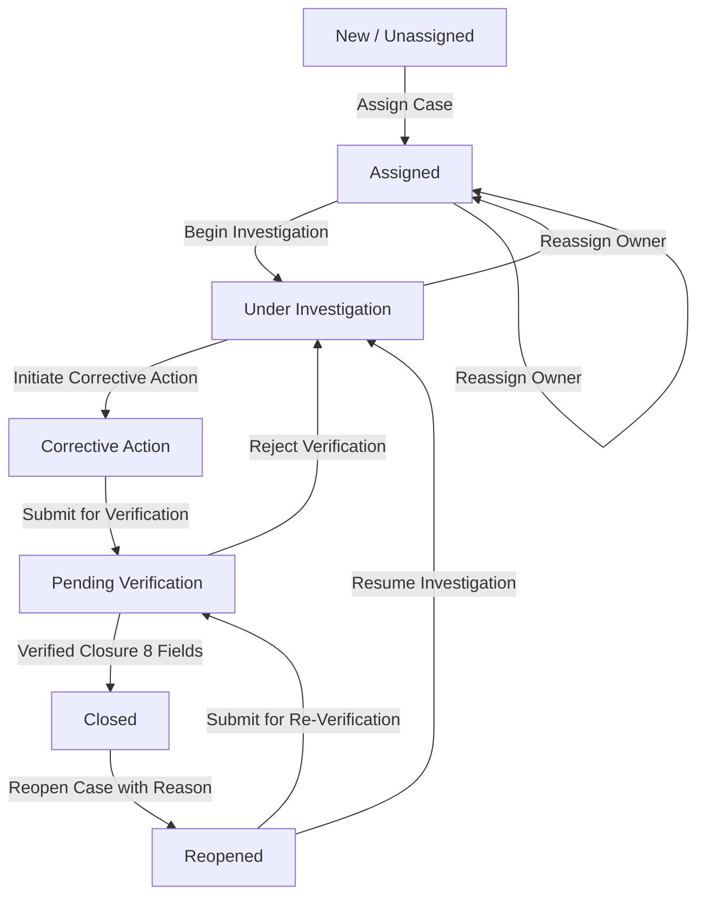

# TRIS — Governed Case Lifecycle, Reopening Flows & Security Architecture

**System**: Trust & Risk Intelligence System (TRIS)  
**Version**: 1.3 (with v1.4 Production Hardening Specifications)  
**Document Type**: Engineering & Governance Reference Specification  
**Status**: ACTIVE & FORMALIZED  
**Reference Sources**: `tris updated.pdf` (Sections 6, 9, 10, 11) & `test data.xlsx` (`Case_Workflow_Sample`, `Developer_Tests`)  

---

## 1. Executive Summary

This document establishes the official reference specification for TRIS Case Management, State Machine Transitions, Reopening Workflows, the 8-Field Verified Closure Gatekeeper, Segregation of Duties (SoD), and Authentication UX.

It clarifies the exact architectural boundaries between the **v1.3 Synthetic Prototype Phase** and the **v1.4 Production Enterprise Hardening Roadmap**.

---

## 2. Governed Case Lifecycle State Machine

The TRIS state machine enforces strict, non-linear case governance. Status mutations cannot bypass intermediary stages, and every transition is immutably recorded in the `case_history` ledger with actor attribution and timestamps.

### 2.1 State Transition Matrix



| Current State | Allowed Destination States | Required Actor Action / Payload | Operational Context |
| :--- | :--- | :--- | :--- |
| **`New`** | `Assigned` | Assignee Name & Department | Triage allocates case to investigator |
| **`Assigned`** | `Under Investigation` | Investigation started | Investigator begins inquiry into target anomaly |
| **`Under Investigation`** | `Corrective Action` | Root cause identified | Remediation plan developed with supplier/finance |
| **`Corrective Action`** | `Pending Verification` | Remediation completed | Case submitted to Compliance for independent audit |
| **`Pending Verification`** | `Closed` | **8 Mandatory Closure Fields** | Compliance Verifier validates controls & seals certificate |
| **`Pending Verification`** | `Under Investigation` | Rejection Note | Compliance rejects closure; returned for rework |
| **`Closed`** | `Reopened` | Mandatory Reopen Reason | Audit recurrence or fresh evidence triggers review |
| **`Reopened`** | `Under Investigation` | Resume Investigation Note | Investigator conducts additional inquiry |
| **`Reopened`** | `Pending Verification` | Re-Verification Request | Administrative/minor recheck routed directly to audit |

---

## 3. Reopened State Machine Workflow Explained

When an investigator or auditor reopens a `Closed` case, TRIS provides two distinct operational pathways:

```
                  ┌────────────────────────────────────────────────────────┐
                  │                 Case Status: REOPENED                  │
                  └──────────────────────────┬─────────────────────────────┘
                                             │
                     ┌───────────────────────┴───────────────────────┐
                     ▼                                               ▼
      [ Resume Investigation ]                        [ Submit for Re-Verification ]
        (Primary Action / Blue)                         (Secondary Action / Outline)
                     │                                               │
                     ▼                                               ▼
          Under Investigation                               Pending Verification
                     │                                               │
    • Gather fresh vendor evidence                  • Administrative correction
    • Re-interview supplier representatives         • Minor evidence attachment
    • Update root cause / corrective action         • Direct handoff to Compliance
```

1. **`Resume Investigation` (Primary Path)**:
   - **Purpose**: Deep forensic follow-up. Used when new anomalous transactions occur, supplier banking data changes again, or prior corrective action was deemed insufficient.
   - **Destination**: `Under Investigation`.
2. **`Submit for Re-Verification` (Fast-Track Path)**:
   - **Purpose**: Administrative or expedited re-audit. Used when the reopening was purely to amend documentation or re-verify an existing control without requiring new investigative steps.
   - **Destination**: `Pending Verification`.

---

## 4. The 8-Field Verified Closure Gatekeeper

Per Section 9 of `tris updated.pdf` and Test `T06`/`T09`, a case **cannot** be closed merely by clicking a button. The system validates that all 8 mandatory compliance fields are present and non-empty.

### 4.1 Mandatory Field Dictionary

| # | Field Name | SQL Column | Data Type | Specification Description & Example |
| :---: | :--- | :--- | :--- | :--- |
| **1** | **Root Cause Analysis** | `root_cause` | `TEXT` | Detailed explanation of control failure (e.g. *"Compromised vendor portal credentials used for off-hours bank change"*). |
| **2** | **Corrective Action Plan** | `corrective_action` | `TEXT` | Specific remediation executed (e.g. *"Restored original bank details; placed hold on invoice NC-260828"*). |
| **3** | **Closure Type** | `closure_type` | `VARCHAR(50)` | Category: `Financial/Control`, `Supplier`, `Access/Security`, `Compliance`, or `Process`. |
| **4** | **Closure Evidence Reference** | `closure_evidence` | `VARCHAR(255)` | Audit ticket, file reference, or document ID (e.g. `DOC-TEST-001` or `SEC-2026-881`). |
| **5** | **Verified By** | `verified_by` | `VARCHAR(100)` | Name and title of independent auditor (e.g. `B. Verifier (Compliance Controls Auditor)`). |
| **6** | **Closure Date** | `closure_date` | `DATE` | Formal timestamp when verification was executed. |
| **7** | **Follow-up Requirement** | `follow_up_requirement` | `TEXT` | Mandatory post-closure retest (e.g. *"Mandatory MFA rollout; retest vendor in 30 days"*). |
| **8** | **Recurrence Monitoring** | `recurrence_monitoring` | `TEXT` | Surveillance protocol (e.g. *"Enrolled in 90-day automated bank modification monitoring"*). |

---

## 5. Segregation of Duties (SoD) & Role Boundaries

### 5.1 Specification Baseline (`tris updated.pdf` & `test data.xlsx`)

In the reference dataset provided in `test data.xlsx` (`Case_Workflow_Sample` sheet):
- **Case Owner / Lead Investigator**: `A. Reviewer` (Finance)
- **Independent Verifier**: `B. Verifier` (Compliance)
- **PDF Scope (Section 11)**: *"Basic role-aware access in the staging prototype if authentication is already present; otherwise document it as a later security milestone."*

### 5.2 Version Comparison: v1.3 Prototype vs. v1.4 Production Hardening

| Governance Dimension | v1.3 Synthetic Prototype (Current) | v1.4 Production Enterprise Hardening (Roadmap) |
| :--- | :--- | :--- |
| **Closure Validation Gatekeeper** | Enforces that all 8 fields are complete and non-empty (returns `422 Unprocessable Content` if incomplete). | Same 8-field strict gatekeeper with cryptographic signature verification. |
| **Permitted Transition Callers** | `["reviewer", "verifier", "compliance", "admin"]`. Allows seamless end-to-end testing by investigators. | Strictly restricted by stage: `reviewer` can only submit to `Pending Verification`; only `verifier`/`compliance`/`admin` can seal `Closed`. |
| **Four-Eyes Principle Enforcement** | Field-level attribution (`verified_by` text field must name the independent verifier). | Server-enforced identity check (`current_user.role IN ('verifier', 'compliance', 'admin')` AND `current_user.user_id != case.assigned_to`). |
| **Reviewer UI at Pending Verification** | Action buttons visible for rapid local test execution. | Action buttons disabled/hidden for Reviewer with banner: *"Pending Compliance Review (Verifier Clearance Required)"*. |

---

## 6. Authentication Architecture & Demo Sandbox UX

The TRIS login interface balances zero-friction demo evaluation with enterprise authentication security.

### 6.1 Authentication Principles
1. **Empty Inputs by Default**:
   - `Email` and `Password` inputs load completely blank on initial page load (adheres to Jakob's Law of UX).
   - The `Email` field receives immediate browser `autoFocus`.
   - Allows users to conduct negative testing (e.g. invalid passwords) without backspacing pre-filled text.
2. **Demo Sandbox Personas Container**:
   - Role cards are explicitly framed inside an **Interactive Evaluation Sandbox** card with an `Evaluation Mode` badge.
   - **Clicking a Persona Card**: Auto-fills the credentials and highlights the active role without unexpected auto-submitting.
   - **Hover Quick Sign-In**: Provides an optional 1-click arrow shortcut for high-efficiency presentations.
3. **Enterprise Cryptography**:
   - Passwords authenticated via **Argon2id** (memory-hard, GPU-resistant).
   - Session tokens delivered exclusively via secure **HttpOnly, SameSite=Lax** cookies.
4. **Environment Gating**:
   - In production environments without demo mode (`NEXT_PUBLIC_ENABLE_DEMO_ACCOUNTS=false`), demo persona cards are automatically excluded from the bundle.

---

## 7. Compliance & Traceability Mapping

| Acceptance Test ID | Requirement | Document Section | Verified Implementation |
| :---: | :--- | :--- | :--- |
| **T05** | Ownership & Assignment | PDF Sec 6 / Test T05 | `CaseService.transition_case` persists owner, department, and timestamp. |
| **T06 / T09** | 8-Field Verified Closure | PDF Sec 9 / Test T06 | Rejects incomplete closure with 422; accepts valid 8-field payload with 200. |
| **T08** | Governed State Machine | PDF Sec 6 / Test T08 | Illegal jumps (e.g. `New` -> `Closed`) rejected with `409 Conflict`. |
| **T10** | Immutable Audit Trail | PDF Sec 7 / Test T10 | PostgreSQL trigger blocks `UPDATE`/`DELETE` on `case_history`. |