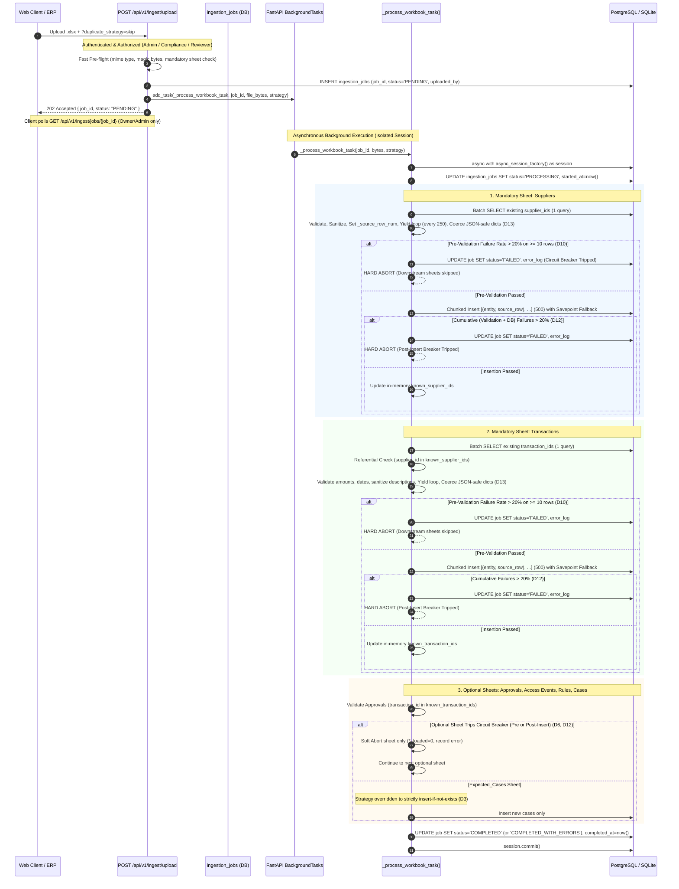

# 🔄 TRIS Ingestion Engine — Architecture, Resilience & Scale Plan (Revision 2.2)

**System**: Trust & Risk Intelligence System (TRIS)  
**Module**: Ingestion & Data Pipeline (`app/api/modules/v1/ingestion/`)  
**Document Type**: Architectural Specification & Production Resilience Blueprint  
**Revision**: 2.2 (JSON Serialization Guard, Cumulative Post-Insert Breaker Accounting [D12], Event-Loop Yielding & Savepoint Isolation)  
**Status**: ARCHITECTURAL SIGN-OFF & IN IMPLEMENTATION  
**Audience**: Principal Engineers, Backend Architects, Code Reviewers  

---

## 1. Executive Summary & Architecture Decisions

This blueprint specifies the production architecture for the TRIS Data Ingestion Subsystem. It resolves the structural gaps of the initial prototype and incorporates strict security boundaries, asynchronous background processing, row-level error isolation with rich JSON-safe diagnostics, and dialect-agnostic bulk resilience.

### Senior Architect Decision & Judgment Call Log

| # | Architectural Decision | Hard Stance | Rationale & Technical Specification |
| :- | :--- | :---: | :--- |
| **D1** | **Ownership-Based Job Telemetry** | **403 Forbidden** *(Judgment Call)* | `GET /api/v1/ingest/jobs/{job_id}` enforces that `current_user.user_id == job.uploaded_by` OR `current_user.role in ("admin", "compliance")`. Returns `403 FORBIDDEN` via `PermissionDeniedError` consistent with `case_routes.py`. Prevents cross-tenant telemetry & raw payload scraping. |
| **D2** | **Ingestion Ingress RBAC** | **Role-Gated (`admin`, `compliance`, `reviewer`)** *(Judgment Call)* | `POST /api/v1/ingest/upload` requires `require_roles(["admin", "compliance", "reviewer"])`. Disallows unprivileged accounts (e.g. `procurement`) from loading master vendor data or financial ledgers. Returns `403` on unauthorized roles, `401` on unauthenticated. |
| **D3** | **Immutable Case Boundary** | **Strict Exemption** | `duplicate_strategy=update` **NEVER** updates `RiskCase` or `CaseHistory`. The `Expected_Cases` sheet is strictly insert-if-not-exists. Overwriting existing cases via file upload bypasses the state machine, role gating, and 8-field verified closure audit trail. |
| **D4** | **Async Session Lifecycle** | **Independent Worker Session** | The request-scoped `AsyncSession` from FastAPI `Depends(get_db)` is **never** passed into `BackgroundTasks`. The background worker instantiates its own isolated session via `async with async_session_factory() as session:`, eliminating `DetachedInstanceError`. |
| **D5** | **Bulk Chunk Error Isolation** | **Adaptive Savepoint Fallback with Source Dicts** *(Judgment Call)* | 500-row chunks are paired as `(entity, source_row_dict)` tuples. If a bulk chunk flush fails at the DB layer, the engine enters an atomic savepoint fallback: retrying rows individually to isolate the single bad row into `error_log` (with its exact raw source dict) while committing the remaining 499 rows. Works across PostgreSQL and SQLite. |
| **D6** | **Decoupled Circuit Breaker** | **Hard on Required, Soft on Optional** | A circuit breaker trip (>20% errors on $\ge 10$ rows) on **Required Sheets** (`Suppliers`, `Transactions`) aborts the entire job immediately (`status=FAILED`). A trip on **Optional Sheets** (`Approvals`, `Access_Events`, `Demo_Rules`) aborts only that sheet, logging the failure while allowing the job to finish as `COMPLETED_WITH_ERRORS`. |
| **D7** | **Bidirectional Referential Pre-flight** | **Suppliers & Transactions** | Pre-validates `Transactions.supplier_id` against known suppliers, AND `Approvals.transaction_id` against known transactions. Missing parents are skipped and logged as referential validation errors, never triggering uncaught DB FK exceptions. |
| **D8** | **Guaranteed Terminal State** | **Try/Except Catch-All + Timeout** | Worker body is wrapped in a top-level `try/except Exception` ensuring any unhandled failure writes `status=FAILED` and error details to the DB. A read-time staleness guard marks any job `PROCESSING` > 10 minutes as `FAILED`. |
| **D9** | **Persistence Sanitization Scope** | **Control Chars & Length Only (No HTML Escape)** | `sanitize_text()` strips ASCII control characters (`[\x00-\x08\x0b\x0c\x0e-\x1f\x7f]`) and truncates to column `max_length`. **HTML escaping is omitted at the ingestion layer** to prevent database double-encoding (`&amp;`) and search corruption. React handles output encoding at UI render time. |
| **D10** | **Circuit Breaker Evaluation Timing** | **Pre-Insert Validation Check** | Evaluated once after full-sheet in-memory validation completes, before DB writes begin. Avoids DB write attempts if validation failure rate is already fatal. |
| **D11** | **Validation Event-Loop Yielding** | **Periodic `await asyncio.sleep(0)`** | FastAPI `BackgroundTasks` runs on the application event loop. To prevent event-loop starvation during intensive CPU validation of large DataFrames, the validation loop yields control every 250 rows (`if idx % 250 == 0: await asyncio.sleep(0)`). |
| **D12** | **Cumulative Post-Insert Failure Accounting** | **Cumulative Check (Validation + DB Failures)** *(Settled Decision)* | DB-constraint failures during chunk insertion are counted cumulatively alongside pre-validation failures: `total_failures = validation_failures + db_insert_failures`. If the cumulative failure rate exceeds 20% on $\ge 10$ rows, the circuit breaker trips post-insert, enforcing the hard/soft abort contract. Prevents partially corrupted datasets from running downstream risk calculations. |
| **D13** | **JSON Primitive Serialization Guard** | **Coerce `_to_json_safe()` at Capture** | Source row dicts undergo conversion of `pandas.Timestamp`, `datetime.date`, and numpy scalar types (`int64`, `float64`, `bool_`) to native JSON-serializable primitives (ISO strings, Python ints/floats/bools) at capture time. Prevents `TypeError` during SQLAlchemy JSON/JSONB persistence in `error_log`. |

---

## 2. End-to-End Resilient Pipeline Flow



---

## 3. Data Models & Database Specifications

### 3.1 `IngestionJob` Model (`app/api/modules/v1/ingestion/models/ingestion_job.py`)

```python
from datetime import UTC, datetime
from typing import Any
from sqlalchemy import JSON, Column
from sqlmodel import Field, SQLModel

class IngestionJob(SQLModel, table=True):
    """Tracks asynchronous workbook ingestion lifecycles, progress, and audit logs."""

    __tablename__ = "ingestion_jobs"

    job_id: str = Field(primary_key=True, index=True, max_length=50)
    status: str = Field(default="PENDING", index=True, max_length=30)
    # Lifecycle: PENDING -> PROCESSING -> COMPLETED | COMPLETED_WITH_ERRORS | FAILED

    filename: str | None = Field(default=None, max_length=255)
    file_size_bytes: int = Field(default=0)
    uploaded_by: str = Field(foreign_key="users.user_id", index=True, max_length=50)
    duplicate_strategy: str = Field(default="skip", max_length=20)  # skip | update | fail

    total_rows: int = Field(default=0)
    processed_rows: int = Field(default=0)
    inserted_rows: int = Field(default=0)
    updated_rows: int = Field(default=0)
    skipped_rows: int = Field(default=0)
    error_rows: int = Field(default=0)

    summary_report: dict[str, Any] = Field(
        default_factory=dict,
        sa_column=Column(JSON, nullable=False),
    )
    error_log: list[dict[str, Any]] = Field(
        default_factory=list,
        sa_column=Column(JSON, nullable=False),
    )  # [{sheet: str, row: int, field: str, error: str, raw_value: dict}]

    started_at: datetime | None = Field(default=None, nullable=True)
    completed_at: datetime | None = Field(default=None, nullable=True)
    created_at: datetime = Field(default_factory=lambda: datetime.now(UTC), index=True)
```

---

## 4. Key Functions & Implementations

### 4.1 JSON Primitive Serialization Guard (`_to_json_safe`)

```python
from datetime import date, datetime
from typing import Any
import pandas as pd

def _to_json_safe(v: Any) -> Any:
    """Coerces pandas and numpy scalars to native JSON-serializable types."""
    if pd.isna(v):
        return None
    if isinstance(v, (pd.Timestamp, datetime, date)):
        return v.isoformat()
    if hasattr(v, "item"):  # numpy int64, float64, bool_
        return v.item()
    return v
```

### 4.2 Cumulative Circuit Breaker Logic (`D10` & `D12`)

```python
CIRCUIT_BREAKER_THRESHOLD = 0.20  # 20%
CIRCUIT_BREAKER_MIN_SAMPLES = 10

def check_circuit_breaker(
    sheet_name: str,
    total_rows: int,
    error_count: int,
    is_mandatory: bool,
    stage: str = "validation",
) -> None:
    """
    Evaluates cumulative failure ratio.
    Raises CircuitBreakerTrippedError if error_count / total_rows > 0.20 on >= 10 rows.
    """
    if total_rows < CIRCUIT_BREAKER_MIN_SAMPLES:
        return
    ratio = error_count / total_rows
    if ratio > CIRCUIT_BREAKER_THRESHOLD:
        raise CircuitBreakerTrippedError(
            sheet_name=sheet_name,
            error_count=error_count,
            total_rows=total_rows,
            is_mandatory=is_mandatory,
            stage=stage,
        )
```

---

## 5. Test Matrix for Rev 2.2 (18 Scenarios)

1. `test_upload_unauthenticated_rejected` (401)
2. `test_upload_low_privilege_role_rejected` (403 for `procurement`)
3. `test_upload_authorized_returns_202` (202 Accepted + `job_id`)
4. `test_get_job_telemetry_unauthenticated` (401)
5. `test_get_job_telemetry_unauthorized_owner` (403 for non-owner/non-admin)
6. `test_get_job_telemetry_admin_override` (200 for admin viewing another user's job)
7. `test_case_immutability_under_update_strategy` (Existing `RiskCase` untouched under `duplicate_strategy=update`)
8. `test_background_session_independence` (Worker completes without `DetachedInstanceError`)
9. `test_chunk_savepoint_isolation_single_bad_row` (500-row chunk with 1 bad row commits 499 rows, logs 1 error)
10. `test_chunk_savepoint_isolation_postgres` (Postgres-backed savepoint verification per `test-database-isolation/SKILL.md`)
11. `test_error_log_captures_source_row_dict_and_exact_row_number` (Asserts row number matches spreadsheet row and `raw_value` is `dict`)
12. `test_error_log_json_serialization_roundtrip` (Asserts Timestamp/numpy types persist cleanly through JSON column into DB)
13. `test_validation_event_loop_yielding` (Asserts `asyncio.sleep(0)` executes during validation of $\ge 250$ rows)
14. `test_suppliers_circuit_breaker_hard_abort` (Mandatory sheet trips in validation $\rightarrow$ whole job `FAILED`)
15. `test_cumulative_post_insert_circuit_breaker_hard_abort` (DB errors push failures past 20% $\rightarrow$ Hard Abort `FAILED`)
16. `test_optional_sheet_circuit_breaker_soft_abort` (Optional sheet trips $\rightarrow$ job finishes as `COMPLETED_WITH_ERRORS`)
17. `test_approvals_unlinked_transaction_fk_skipped` (Approval for non-existent `TX-9999` skipped & logged)
18. `test_worker_unhandled_exception_reaches_failed` (Crash mid-run leaves job in `FAILED`, never `PROCESSING`)
19. `test_special_characters_stored_without_html_escape` (Raw `&`, `<`, `>`, `"` stored uncorrupted)
