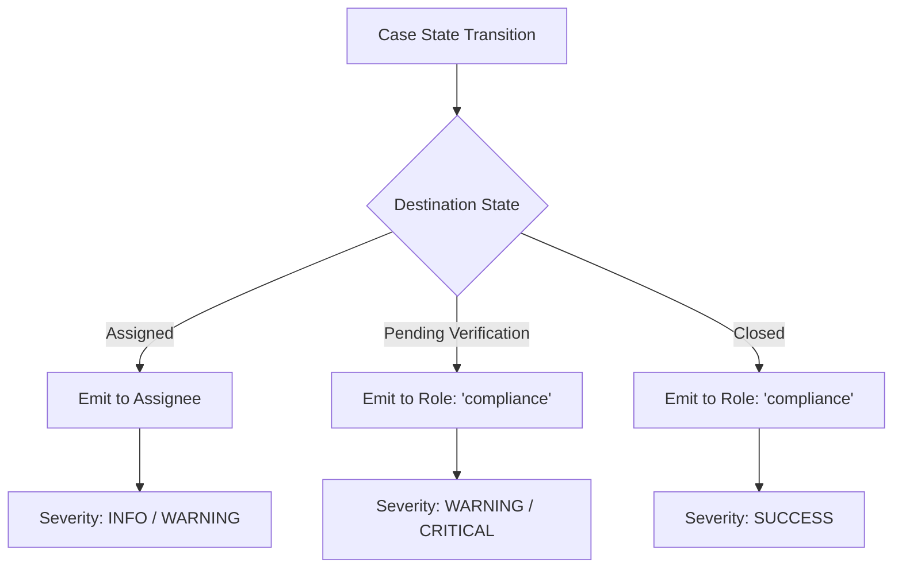

# TRIS — Real-Time Notification Hub & Event Alerting Architecture

**System**: Trust & Risk Intelligence System (TRIS)  
**Version**: 1.3  
**Document Type**: Engineering Architecture Specification & ADR-010  
**Status**: ACCEPTED & IMPLEMENTED  
**Target Module**: `backend/app/api/modules/v1/notifications/` & `frontend/components/notifications-popover.tsx`  

---

## 1. Executive Summary

TRIS v1.3 introduces a dedicated, PostgreSQL-backed **Notification Hub** providing real-time, context-aware operational alerting across risk investigations, background file ingestion workflows, and zero-trust security events. 

Prior to this implementation, the frontend header relied on static mock fixtures (`sampleNotifications`). The notification system is now fully relational, multi-tenant/role-scoped, auditable, and decoupled from core business operations via non-blocking domain event emissions.

---

## 2. Core Architectural Principles

1. **Strict 4-Layer Backend Decoupling**:
   - `models/notification.py`: SQLModel ORM table declaration with composite database indexes.
   - `schemas/notification_schemas.py`: Pydantic v2 DTOs for request parsing and response envelopes.
   - `service/notification_service.py`: Business logic for multi-tier RBAC filtering, optimistic mutations, and `NotificationService.emit(...)`.
   - `routes/notification_routes.py`: Lean FastAPI HTTP gateway (`< 50` lines per handler, zero business logic, zero `try-except` masking).
2. **Multi-Tier Recipient Scoping**:
   - **User-Targeted**: Explicit alerts sent to `recipient_user_id` (e.g. case reassignment, specific job upload).
   - **Role-Targeted**: Alerts broadcast to all users holding a specific operational `recipient_role` (e.g., `compliance` officers alerted on `Pending Verification` submissions).
   - **System Broadcast**: Global broadcasts where `recipient_user_id IS NULL AND recipient_role IS NULL` (e.g., scheduled maintenance, security advisories).
3. **Automated Domain Event Emissions**:
   - Core domain services (`CaseService`, `IngestionService`) emit structured notifications at critical state boundaries.
   - Failure to emit a notification never rolls back an approved transaction; notifications are emitted within the transaction boundary or logged as warnings.
4. **Optimistic UI & Zero-Latency UX**:
   - Client applications consume typed REST endpoints with optimistic state updates and 30-second background polling.
   - Deep links enable one-click navigation directly to affected workspaces (`/cases/{id}`, `/zero-trust`, `/ingestion`).

---

## 3. Relational Database Schema (`notifications`)

The `Notification` table is managed via SQLModel and persisted in PostgreSQL:

```sql
CREATE TABLE notification (
    notification_id VARCHAR(50) PRIMARY KEY,
    recipient_user_id VARCHAR(50) NULL REFERENCES "user"(user_id) ON DELETE SET NULL,
    recipient_role VARCHAR(50) NULL,
    title VARCHAR(200) NOT NULL,
    message VARCHAR(1000) NOT NULL,
    category VARCHAR(50) NOT NULL DEFAULT 'SYSTEM',
    severity VARCHAR(20) NOT NULL DEFAULT 'INFO',
    link_url VARCHAR(500) NULL,
    is_read BOOLEAN NOT NULL DEFAULT FALSE,
    read_at TIMESTAMP WITH TIME ZONE NULL,
    metadata_json JSONB NULL,
    created_at TIMESTAMP WITH TIME ZONE NOT NULL DEFAULT CURRENT_TIMESTAMP
);

-- Optimized Composite Indexes for Sub-Millisecond Unread Lookups
CREATE INDEX ix_notification_user_unread ON notification(recipient_user_id, is_read);
CREATE INDEX ix_notification_role_unread ON notification(recipient_role, is_read);
CREATE INDEX ix_notification_created_at ON notification(created_at DESC);
```

### Supported Severities & Categories

| Attribute | Values | Description |
|---|---|---|
| **Severity** | `CRITICAL`, `WARNING`, `INFO`, `SUCCESS` | Drives UI visual treatment (red shield, amber alert, blue info, green check) |
| **Category** | `CASE_ALERT`, `SECURITY_EVENT`, `INGESTION_JOB`, `SYSTEM` | Defines functional grouping and badge rendering |

---

## 4. Multi-Tier RBAC Scoping Logic

When an authenticated user requests `GET /api/v1/notifications` or `GET /api/v1/notifications/unread-count`, the query dynamically constructs an `OR` filter guaranteeing strict tenant and role isolation:

$$\text{Visible Notifications} = \{ n \in \text{Notification} \mid n.\text{user\_id} = \text{caller}.\text{id} \lor n.\text{role} = \text{caller}.\text{role} \lor (n.\text{user\_id} \text{ IS NULL} \land n.\text{role} \text{ IS NULL}) \}$$

```python
# app/api/modules/v1/notifications/service/notification_service.py
recipient_filters = [
    Notification.recipient_user_id == current_user.user_id,
    Notification.recipient_role == current_user.role,
    (Notification.recipient_user_id.is_(None) & Notification.recipient_role.is_(None)),
]
query = select(Notification).where(or_(*recipient_filters))
```

---

## 5. Domain Event Integration Points

### 5.1 Case Lifecycle State Machine (`CaseService.transition_case`)

State transitions trigger automated alerts based on the destination state and operational roles:



1. **Case Assignment**:
   - **Trigger**: Transition to `Assigned` with `assigned_to` designated.
   - **Recipient**: `recipient_user_id = assigned_to`.
   - **Severity**: `INFO` (or `WARNING` if priority is High).
   - **Deep Link**: `/cases/{case_id}`.
2. **Pending Verification Submission**:
   - **Trigger**: Transition to `Pending Verification`.
   - **Recipient**: `recipient_role = "compliance"`.
   - **Message**: *"Case {case_number} submitted for compliance review and 8-field verified closure."*
   - **Severity**: `WARNING`.
3. **Verified Closure Sealed**:
   - **Trigger**: Transition to `Closed` passing 8-field verification.
   - **Recipient**: `recipient_role = "compliance"`.
   - **Message**: *"Case {case_number} verified and closed by {verified_by}."*
   - **Severity**: `SUCCESS`.

### 5.2 Background Ingestion Job Telemetry (`IngestionService.run_ingestion_job`)

Asynchronous background workbook processing reports lifecycle status directly to the uploader:

1. **Job Completed Successfully**:
   - **Recipient**: `recipient_user_id = job.uploaded_by`.
   - **Message**: *"Master dataset processed cleanly. {suppliers} suppliers and {txns} invoices ingested."*
   - **Severity**: `SUCCESS`.
   - **Deep Link**: `/ingestion`.
2. **Job Completed With Partial Errors**:
   - **Recipient**: `recipient_user_id = job.uploaded_by`.
   - **Message**: *"Workbook ingested with {errors} row validation issues."*
   - **Severity**: `WARNING`.
3. **Hard Abort / Circuit Breaker Trip / Fatal Failure**:
   - **Recipient**: `recipient_user_id = job.uploaded_by`.
   - **Message**: *"Ingestion job failed: {error_summary}"*
   - **Severity**: `CRITICAL`.

---

## 6. REST API Endpoints Specification

All endpoints are mounted at `/api/v1/notifications` and require JWT authentication via HttpOnly session cookies.

### 1. `GET /api/v1/notifications`
* **Query Parameters**:
  - `limit` (int, default: 50, max: 100)
  - `offset` (int, default: 0)
  - `unread_only` (bool, optional)
  - `category` (string, optional)
  - `severity` (string, optional)
* **Response**: `ApiResponse<List[NotificationResponse]>`

### 2. `GET /api/v1/notifications/unread-count`
* **Response**: `ApiResponse<UnreadCountResponse>` (`{"unread_count": 4}`)

### 3. `PATCH /api/v1/notifications/{notification_id}/read`
* **Path Parameters**: `notification_id` (string)
* **Response**: `ApiResponse<NotificationResponse>`

### 4. `POST /api/v1/notifications/mark-all-read`
* **Response**: `ApiResponse<Dict[str, int]>` (`{"updated_count": 4}`)

### 5. `POST /api/v1/notifications` (Admin / Internal Service Emission)
* **Request Body**: `NotificationCreateRequest`
* **Response**: `ApiResponse<NotificationResponse>` (Status `201 Created`)

---

## 7. Frontend Integration & UX

The `NotificationsPopover` sits in the sticky top command header:

1. **Live Unread Counter**:
   - Fetches unread count on mount and polls every 30 seconds.
   - Red notification pill displayed when `unreadCount > 0` with zoom-in animation.
2. **Tabbed Filtering**:
   - `All`: Full chronological ledger.
   - `Unread`: Only unread operational action items.
   - `High Risk`: Filtered to `severity IN ('CRITICAL', 'WARNING')`.
3. **One-Click Mark-as-Read & Deep Navigation**:
   - Clicking any notification marks it as read optimistically, decrements the badge, and routes the user to `link_url`.
4. **Bulk Action**:
   - "Mark all read" button dispatches bulk update and surfaces a confirmation toast.

---

## 8. Verification Matrix & Test Evidence

The notification module is verified by automated tests in `backend/tests/modules/v1/test_notifications.py`:

```bash
uv run pytest tests/modules/v1/test_notifications.py -v
```

| Test Case | Description | Result |
|---|---|:---:|
| `test_unauthenticated_notifications_rejected` | Unauthenticated requests receive HTTP 401 | 🟢 PASSED |
| `test_list_user_and_role_scoped_notifications` | Verifies user-specific, role-specific, and broadcast scoping | 🟢 PASSED |
| `test_unread_count_endpoint` | Verifies accurate count filtering on unread items | 🟢 PASSED |
| `test_mark_single_read_and_mark_all_read` | Tests individual and bulk mark-as-read transitions | 🟢 PASSED |
| `test_case_transition_emits_notifications` | Validates domain event emissions during case state changes | 🟢 PASSED |

**Full System Test Suite**: **78 / 78 tests passing (100%)**.

---

## 9. Future Roadmap (v1.4+)

- **Server-Sent Events (SSE) / WebSocket Gateway**: Replace 30-second client polling with server-push event streams over `/api/v1/notifications/stream`.
- **Email & Webhook Dispatchers**: Configurable outbound notifications via SMTP or Slack/Teams webhooks for high-priority `CRITICAL` risk alerts.
- **User Preference Matrix**: Per-user notification preference toggles by category and severity.