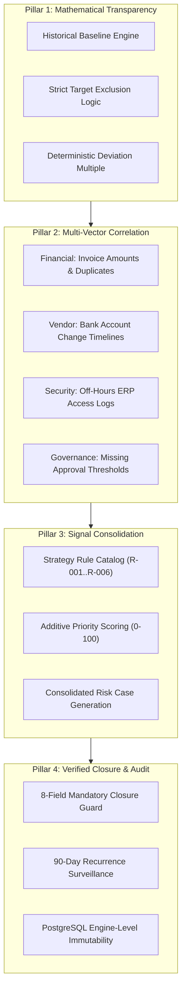

# 💡 TRIS v1.3: Solution Design & Engineering Blueprint

**System**: Trust & Risk Intelligence System (TRIS)  
**Version**: 1.3 (Synthetic-Data Driven Architecture)  
**Document Type**: End-to-End Enterprise Solution Design & Problem-to-Value Mapping  
**Author**: Lead Risk Systems Architect & Solutions Engineer  
**Status**: APPROVED & ACTIVE  

---

## 🎯 1. Context & Business Domain

In enterprise supply chain management and manufacturing operations, accounts payable fraud and procurement anomalies represent multi-million-dollar exposures. Traditional risk monitoring fails primarily due to two opposing extremes:
1. **Dumb Static Filters**: Simple rule checks that alert on individual invoices in isolation, creating alert fatigue and missing multi-vector attacks.
2. **Opaque "Black-Box" AI**: Machine learning models that generate probabilistic risk scores (e.g., *"87% Fraud Probability"*) without transparent mathematical derivation or auditable evidence, making them unacceptable to corporate audit committees, CFOs, and regulatory bodies.

The **Trust & Risk Intelligence System (TRIS)** was created to replace both approaches with **Deterministic, Auditable Risk Intelligence**.

---

## ⚠️ 2. The Problem Statement: Why Existing Systems Fail

```
┌─────────────────────────────────────────────────────────────────────────────────────────┐
│                                 THE FOUR CORE VULNERABILITIES                           │
├──────────────────────────┬──────────────────────────────────────────────────────────────┤
│ Vulnerability            │ Manifestation in Enterprise Operations                       │
├──────────────────────────┼──────────────────────────────────────────────────────────────┤
│ 1. Black-Box Metrics     │ Arbitrary AI confidence percentages with zero audit trail;    │
│                          │ impossible to explain to auditors why an invoice was flagged.│
├──────────────────────────┼──────────────────────────────────────────────────────────────┤
│ 2. Telemetry Silos       │ Invoices, vendor bank account changes, and system access logs│
│                          │ live in disconnected systems; correlated fraud is missed.    │
├──────────────────────────┼──────────────────────────────────────────────────────────────┤
│ 3. Unverified Closures   │ Analysts close cases with a single click ("Reviewed") without│
│                          │ documenting root cause, remediation, or verified evidence.   │
├──────────────────────────┼──────────────────────────────────────────────────────────────┤
│ 4. Recurrence Blindness  │ Closed cases are forgotten; identical control failures repeat│
│                          │ months later without alerting investigators to prior history.│
└──────────────────────────┴──────────────────────────────────────────────────────────────┘
```

---

## 🛠️ 3. The TRIS v1.3 Solution Architecture

TRIS v1.3 resolves each vulnerability through four engineered architectural pillars:



### Pillar 1: Mathematical Transparency (Zero Fake Metrics)
- **Principle**: No alert exists without explicit mathematical derivation.
- **Implementation**: When evaluating whether an invoice amount is anomalous for a supplier, the `BaselineService` calculates descriptive statistics (count, mean, median, min, max, standard deviation) across the supplier's historical transactions.
- **Strict Exclusion Rule**: The transaction currently under evaluation is **strictly excluded** from its own baseline calculation. Including it would artificially inflate the baseline and mask the anomaly.

$$\text{Baseline Mean}(\text{Supplier}) = \frac{1}{N - 1} \sum_{i \in \text{Historical}, i \ne T_{\text{target}}} \text{Amount}_i$$

$$\text{Deviation Ratio} = \frac{\text{Amount}(T_{\text{target}})}{\text{Baseline Mean}}$$

### Pillar 2: Multi-Vector Cross-Domain Correlation
TRIS breaks enterprise silos by correlating four telemetry vectors in real time:
1. **Financial Ledger**: Invoices, amounts, payment terms, currency (`Transactions` table).
2. **Vendor Master Data**: Bank account modifications, routing numbers, risk tiers (`Suppliers` table).
3. **Identity & Access Telemetry**: Authentication timestamps, IP addresses, system areas (`Access_Events` table).
4. **Internal Controls**: Approval hierarchies, role levels, approval timestamps (`Approvals` table).

### Pillar 3: Deterministic Rule Engine & Case Consolidation
- **Modular Strategy Pattern**: Each rule (`R-001` through `R-006`) is an independent, isolated class implementing `evaluate(context: EvaluationContext) -> RuleResult`.
- **Case Consolidation**: Rather than generating 4 separate noisy alerts for a single incident, TRIS consolidates all triggered signals into a **single comprehensive Risk Case** with an aggregated priority score.

### Pillar 4: Enforced Verified Closure & Recurrence Surveillance
- **8-Field Gatekeeper**: A case cannot transition to `Closed` unless the investigator provides all 8 mandatory compliance fields.
- **90-Day Recurrence Engine**: Scans historical cases for matching supplier IDs and root cause categories. When a match is found within 90 days, prior remediation actions are surfaced immediately to prevent repeat failures.
- **Engine-Level Immutability**: The `Case_History` audit log is guarded by a PostgreSQL database trigger, making tampering or deletion impossible even with administrative database access.

---

## 🔬 4. Concrete Walkthrough: Anomaly Detection Scenario (`TEST-CASE-001`)

To demonstrate how the TRIS solution functions end-to-end, consider the synthetic benchmark scenario defined in `test data.xlsx`:

### Step 1: Ingestion of Synthetic Event Stream
The system ingests the synthetic dataset:
- **Supplier**: `SUP-001` (Northstar Components LLC).
- **Target Transaction**: `TX-1999` for **$104,000.00** on `2026-08-22`.
- **Supplier Master Event**: Bank account changed on `2026-08-20` (NL91ABNA0417164300).
- **Internal Control Event**: `AP-1999` is marked **Missing** (Level 3 CFO approval required for > $50,000).
- **Access Telemetry Event**: `AE-003` logged on `2026-08-22` at **22:47:00** (user `usr-finance-04` performing off-hours batch payment approval).

### Step 2: Baseline Calculation with Strict Exclusion
1. `SUP-001` has 8 total transactions: `TX-1001` through `TX-1007` (historical) plus `TX-1999` (target).
2. The Baseline Engine **excludes** `TX-1999` ($104,000.00).
3. Evaluates historical transactions:
   $$\{ \$28,500.00, \$31,200.00, \$29,800.00, \$32,100.00, \$30,400.00, \$31,800.00, \$29,500.00 \}$$
4. **Calculated Baseline Mean**: **$30,471.43** (Median: $30,400.00, Min: $28,500.00, Max: $32,100.00).
5. **Deviation Multiplier**:
   $$\frac{\$104,000.00}{\$30,471.43} = \mathbf{3.413\times}$$

### Step 3: Rule Evaluation & Signal Consolidation

| Rule Code | Rule Name | Condition & Calculation | Triggered? | Weight | Diagnostic Output |
| :--- | :--- | :--- | :---: | :---: | :--- |
| **`R-001`** | Amount Deviation | $3.413\times > 2.0\times$ baseline threshold | **YES** | 35 | "Invoice amount $104,000.00 exceeds supplier baseline average of $30,471.43 by 3.41x (threshold: 2.0x)." |
| **`R-002`** | Recent Bank Change | Bank changed on 2026-08-20, txn on 2026-08-22 (2 days $\le 7$ days) | **YES** | 25 | "Supplier bank account was modified 2 days prior to transaction execution (lookback threshold: 7 days)." |
| **`R-003`** | Missing Approval | Invoice $104,000 > $50,000 threshold; AP-1999 status = Missing | **YES** | 25 | "Transaction exceeds Level 3 control threshold ($50,000) but lacks required CFO approval record." |
| **`R-004`** | Unusual Access Hours | Access event `AE-003` timestamp 22:47 outside 06:00-20:00 window | **YES** | 15 | "Telemetry indicates batch approval execution at 22:47:00, outside authorized operating hours (06:00-20:00)." |
| **`R-005`** | Duplicate Invoice | Check for identical supplier + invoice number | **NO** | 0 | "No duplicate invoice number detected for INV-2026-089." |
| **`R-006`** | 90-Day Recurrence | Scan for matching supplier root cause in prior 90 days | **NO** | 0 | "No previous closed case found within 90-day surveillance lookback." |

### Step 4: Additive Scoring & Case Consolidation
$$\text{Composite Score} = 35 + 25 + 25 + 15 = \mathbf{100} \implies \mathbf{HIGH\ PRIORITY}$$

The system consolidates all 4 signals into a single case record:
- **Case ID**: `TEST-CASE-001`
- **Case Number**: `CASE-2026-0001`
- **Priority**: `High`
- **Status**: `New`
- **Trigger Signals**: `["R-001", "R-002", "R-003", "R-004"]`
- **Evaluation Snapshot**: Saved as JSONB containing exact weights, baseline values, and parameters used.

### Step 5: Governed Case Lifecycle & Verified Closure
1. **Assignment**: Case transitioned from `New` to `Assigned` (Owner: `A. Reviewer`, Department: `Finance`).
2. **Investigation**: Transitioned to `Under Investigation`. Reviewer confirms vendor email compromise.
3. **Corrective Action**: Transitioned to `Corrective Action`. Vendor credentials revoked, payment held.
4. **Pending Verification**: Submitted for closure review.
5. **Premature Closure Attempt**: An attempt to close the case with missing fields returns HTTP `422 Unprocessable Entity`:
   ```json
   {
     "detail": "Verified closure failed: missing mandatory fields [closure_evidence, verified_by]"
   }
   ```
6. **Successful Verified Closure**: When all 8 mandatory fields are supplied, the case transitions to `Closed`:
   - `root_cause`: "Compromised ERP credentials used to alter vendor bank accountNL91ABNA0417164300."
   - `corrective_action`: "Revoked compromised credentials, reverted bank account to verified baseline, placed vendor on 90-day surveillance."
   - `closure_type`: "Financial/Control"
   - `closure_evidence`: "DOC-TEST-001"
   - `verified_by`: "B. Verifier"
   - `closure_date`: "2026-08-31T16:00:00Z"
   - `follow_up_requirement`: "Quarterly audit of vendor master change logs."
   - `recurrence_monitoring`: "90 days active surveillance."
7. **Audit Record**: Database trigger confirms immutable row written to `Case_History` with verified JWT actor identity.

---

## 📊 5. Developer Acceptance Criteria Matrix (T01 - T10)

The TRIS v1.3 solution is validated against 10 strict developer acceptance tests:

| Test ID | Acceptance Objective | Input Data | Expected Mathematical & Behavioral Outcome |
| :---: | :--- | :--- | :--- |
| **`T01`** | Relational Ingestion | `test data.xlsx` (8 sheets) | 18 transactions, 8 suppliers, 8 access events, 10 approvals imported with foreign keys. |
| **`T02`** | Strict Baseline Exclusion | `SUP-001` historical transactions | Baseline mean = **$30,471.43** strictly excluding `TX-1999` ($104,000). |
| **`T03`** | Amount Deviation (R-001) | `TX-1999` ($104,000) | Triggers R-001 with 3.41x deviation ratio (> 2.0x threshold). |
| **`T04`** | Bank Change Lookback (R-002) | `SUP-001` bank update 2026-08-20 | Triggers R-002: 2 days between change and transaction ($\le 7$ days). |
| **`T05`** | Missing Approval (R-003) | `TX-1999` & `AP-1999` | Triggers R-003: Amount > $50,000 threshold and approval status = Missing. |
| **`T06`** | Off-Hours Access (R-004) | `AE-003` at 22:47:00 | Triggers R-004: Event timestamp outside permitted window (06:00-20:00). |
| **`T07`** | Signal Consolidation | Multi-signals on `TX-1999` | Combines R-001..R-004 into single `TEST-CASE-001` with High priority (Score = 100). |
| **`T08`** | Closure Blocking Guard | Premature closure request | Rejects closure when any of the 8 mandatory fields is missing or empty. |
| **`T09`** | Immutable Audit Trail | State transitions on case | Writes append-only `Case_History` entries; DB trigger blocks UPDATE and DELETE. |
| **`T10`** | 90-Day Recurrence Detection | Subsequent supplier exception | Identifies prior case `TEST-CASE-001` and surfaces root cause & corrective action. |

---

## 🏆 6. Value Proposition Summary

| Dimension | Legacy Monitoring | TRIS v1.3 Engineered Solution |
| :--- | :--- | :--- |
| **Explainability** | Probabilistic black box ("87% Risk") | Exact mathematical proof ("$104k is 3.41x historical average of $30,471.43") |
| **Alert Volume** | 4 separate fragmented alerts | 1 unified, consolidated Risk Case |
| **Audit Defense** | Unverifiable manual spreadsheet logs | Engine-enforced immutable PostgreSQL audit trail |
| **Governance** | Unchecked single-click closure | Enforced 8-field verified root-cause & remediation gatekeeper |
| **Repeat Prevention** | Forgotten past incidents | Automated 90-day recurrence scanning and prior-evidence surfacing |
